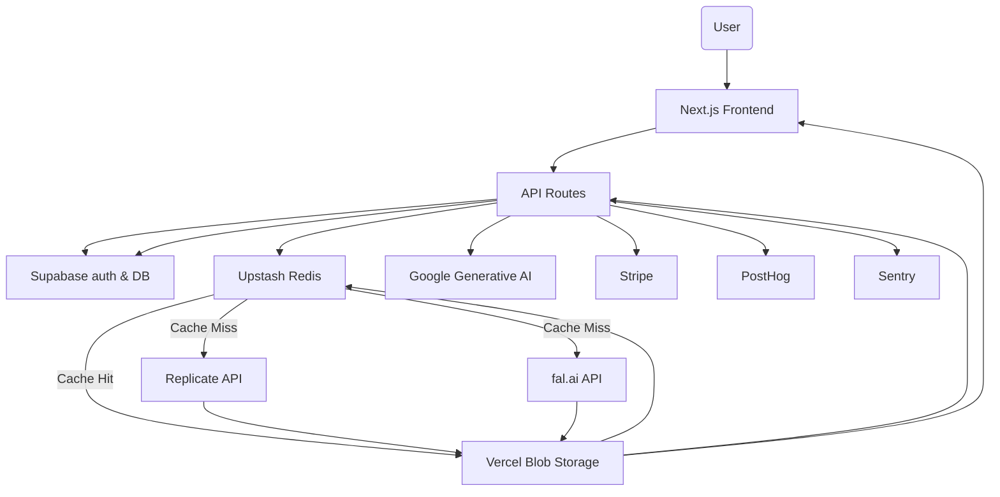

# Architecture Overview

This document outlines the high-level architecture of **SexyVoice.ai** and how data flows through the system. The platform is built with Next.js 15 App Router, featuring server-side rendering, internationalization, and a comprehensive voice generation pipeline.

## Key Components

### Frontend & Framework
- **Next.js 15.4.1 App Router** – Server-side rendering with React 19.1.0 and TypeScript 5.7.3
- **Internationalization** – Route-based i18n supporting English, Spanish, and German (`[lang]` dynamic segments)
- **Styling** – Tailwind CSS 3.4.1 with shadcn/ui components and Radix UI primitives
- **Content Management** – Contentlayer2 for MDX blog processing

### Backend Services
- **Supabase** – Authentication, PostgreSQL database with Row Level Security (RLS)
- **Replicate** – AI voice generation from text using various voice models
- **fal.ai** – Voice cloning from custom audio samples (5 sec - 5 min duration)
- **Google Generative AI** – Text enhancement and emotion tagging

### Storage & Caching
- **Vercel Blob Storage** – Audio file storage with secure URL generation
- **Upstash Redis** – Caches audio URLs using request hashes for performance

### Payment & Analytics
- **Stripe** – Payment processing and credit management
- **PostHog** – User analytics and event tracking
- **Sentry** – Error monitoring with production tunneling through `/monitoring`

### Code Quality & Development
- **Biome** – Linting and formatting with TypeScript strict mode
- **pnpm 9.15.4** – Package management with dependency optimization

## Voice Generation Flow



## Database Schema

### Core Tables

- **`profiles`** - User profiles linked to Supabase Auth
  - Links to credit transactions and audio files
  - Stores Stripe customer IDs and user preferences

- **`voices`** - Voice model definitions
  - System voices (Replicate models) and user-created voices (fal.ai)
  - Includes model metadata, sample URLs, and usage prompts

- **`audio_files`** - Generated audio with comprehensive metadata
  - Links users, voices, and storage keys
  - Tracks credits used, duration, model, and public visibility
  - Supports soft deletion with `deleted_at` timestamp

- **`credit_transactions`** - Complete credit usage history
  - Types: `purchase`, `usage`, `topup`, `freemium`
  - Links to Stripe payments and subscription management
  - Metadata includes transaction details and reference IDs

### Security & Access Control

- **Row Level Security (RLS)** enabled on all tables
- Granular policies for user data access and modification
- Service role access for admin operations and payments
- Secure function definitions with `SECURITY INVOKER` and qualified names

## API Routes

### Voice Generation
- `POST /api/generate-voice` - Text-to-speech with Replicate models
- `POST /api/clone-voice` - Voice cloning with fal.ai from audio uploads
- `POST /api/generate-text` - Text enhancement with Google Generative AI

### User Management  
- `POST /api/stripe/webhook` - Stripe payment webhook handling
- `GET /api/stripe/transactions` - User credit transaction history
- `GET /api/daily-stats` - Usage analytics and statistics
- `GET /api/popular-audios` - Public audio discovery
- `GET /api/health` - Service health monitoring

### Authentication Flow
- Supabase Auth with email/password and social providers
- SSR-compatible session management via middleware
- Protected routes using `(dashboard)` route groups
- Automatic locale detection and redirection

## File Organization

### App Router Structure
```
app/
├── [lang]/                    # Internationalized routes (en/es/de)
│   ├── (auth)/               # Authentication pages
│   │   ├── login/
│   │   ├── signup/
│   │   ├── reset-password/
│   │   └── protected/
│   ├── (dashboard)/          # Protected dashboard routes
│   │   └── dashboard/
│   │       ├── generate/     # Voice generation interface
│   │       ├── clone/        # Voice cloning interface  
│   │       ├── history/      # User audio history
│   │       ├── credits/      # Credit management
│   │       └── profile/      # User profile settings
│   ├── blog/[slug]/         # Dynamic blog posts
│   └── page.tsx             # Landing page
├── api/                     # API route handlers
├── auth/callback/           # OAuth callback handling
└── globals.css             # Global styles
```

### Library Organization
```
lib/
├── supabase/               # Database client and queries
│   ├── client.ts          # Browser client
│   ├── server.ts          # SSR client
│   ├── admin.ts           # Service role client
│   ├── middleware.ts      # Session management
│   ├── queries.ts         # Server-side queries
│   ├── queries.client.ts  # Client-side queries
│   └── types.d.ts         # Generated database types
├── i18n/                  # Internationalization
│   ├── dictionaries/      # Translation files
│   ├── get-dictionary.ts  # Dictionary loader
│   └── i18n-config.ts     # Locale configuration
├── stripe/                # Payment processing
├── redis/                 # Caching utilities
└── utils.ts              # Shared utilities
```

### Detailed Flow

1. **Request Processing**
   - Frontend calls API routes (`POST /api/generate-voice` or `POST /api/clone-voice`)
   - Middleware handles internationalization and Supabase session management
   - API validates request parameters and user authentication

2. **Credit & Permission Validation**
   - Check user credits in Supabase database
   - Validate freemium user limits and restrictions
   - Estimate credit usage based on text length and voice model

3. **Cache Layer**
   - Generate SHA-256 hash from text + voice parameters (8 chars)
   - Check Upstash Redis for cached audio URL
   - Return cached result if found (significant performance improvement)

4. **AI Service Selection** (for cache misses)
   - **Replicate API**: Voice generation with pre-trained models
   - **fal.ai API**: Voice cloning from uploaded audio files
   - **Google Generative AI**: Text enhancement and emotion tags
   - File validation for uploads (10MB max, 5sec-5min duration)

5. **Audio Processing**
   - Convert generated audio to WAV format when needed
   - Upload to Vercel Blob Storage with secure access URLs
   - Generate metadata (duration, credits used, model info)

6. **Data Persistence**
   - Store audio metadata in Supabase `audio_files` table
   - Cache blob URL in Redis for future requests
   - Record credit transaction in `credit_transactions` table
   - Update user credit balance

7. **Analytics & Monitoring**
   - Send usage events to PostHog with user context
   - Log errors and performance metrics to Sentry
   - Track conversion funnel and user engagement

8. **Response Delivery**
   - Return audio URL and metadata to client
   - Handle soft deletion and public/private visibility
   - Support audio history and regeneration features
