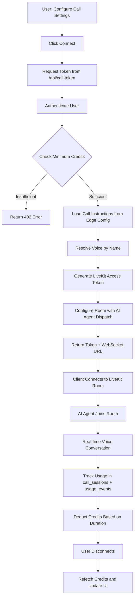

# Architecture Overview

This document outlines the high-level architecture of **SexyVoice.ai** and how data flows through the system.

> For detailed development guidelines, see [AGENTS.md](./AGENTS.md).
> For setup instructions and features, see [README.md](./README.md).

## Overview

SexyVoice.ai is a modern AI voice generation platform built with Next.js, TypeScript, and Supabase. The platform enables users to generate AI voices, clone voices, and manage a library of generated audio content using a credit-based system with support for 20+ languages.

## Key Components

- **Next.js App Router** – React framework with Server Components (RSCs), Suspense, and Server Actions
- **Supabase** – Authentication (OAuth with Google) and PostgreSQL database with SSR support
- **Replicate** – AI voice generation from text (pre-made voices and voice cloning)
- **fal.ai** – Alternative voice cloning service *(optional)*
- **Google Generative AI** – Text-to-speech, text enhancement, and automatic emotion tagging
- **LiveKit** – Real-time voice communication with WebRTC for AI voice calls
- **Cloudflare R2** – Scalable storage for generated audio files and user-uploaded samples with global CDN delivery
- **Upstash Redis** – High-performance caching for audio URLs and request deduplication
- **Vercel Edge Config** – Dynamic configuration for call instructions and presets
- **Stripe** – Payment processing, credit top-ups, subscription management
- **Sentry** – Error tracking and performance monitoring
- **PostHog** – Product analytics and feature flags
- **Inngest** – Background job processing and scheduled tasks

## Voice Generation Flow

API endpoint: `POST /api/generate-voice`


### Steps

1. **Frontend Validation**: User enters text (max 500 chars) and selects a voice
2. **API Authentication**: Verify user session via Supabase Auth
3. **Credit Check**: Query user's credit balance in Supabase
4. **Credit Estimation**: Calculate required credits based on text length
5. **Cache Lookup**: Generate hash from (text + voice + parameters) and check Redis
6. **Cache Hit**: Return cached audio URL immediately (0 credits used)
7. **Cache Miss**:
   - Call appropriate AI service (Replicate or Google Generative AI)
   - Generate audio from text
8. **Storage**: Upload generated audio to Cloudflare R2
9. **Cache Update**: Store R2 URL in Redis for future requests
10. **Background Tasks** (using Next.js `after()`):
    - Deduct credits from user balance
    - Save audio metadata to database
    - Send analytics event to PostHog
11. **Response**: Return audio URL, credits used, and remaining balance

## Voice Cloning Flow

API endpoint: `POST /api/clone-voice`


### Steps

1. **Frontend Validation**: User provides text (max 500 chars), uploads audio file, selects locale
2. **API Authentication**: Verify user session via Supabase Auth
3. **File Validation**:
   - Check MIME type (allowed: MP3, OGG, M4A, WAV)
   - Check file size (max 4.5MB)
   - Extract and validate audio duration (10 seconds to 5 minutes)
4. **Credit Check**: Query user's credit balance in Supabase
5. **Credit Estimation**: Calculate required credits (higher cost than regular generation)
6. **Audio Upload**:
   - Check if user's audio file already exists in R2 Storage
   - If not, upload to `clone-voice-input/{userId}-{sanitizedFilename}`
   - Use existing URL if already uploaded (based on filename)
7. **Cache Lookup**: Generate hash from (locale + text + audio blob URL) and check Redis
8. **Cache Hit**: Return cached cloned audio URL immediately (0 credits used)
9. **Cache Miss**:
   - Select model based on locale:
     - English (`en`): `resemble-ai/chatterbox`
     - Other languages: `resemble-ai/chatterbox-multilingual`
   - Call Replicate API with reference audio and text/prompt
   - Generate cloned voice audio
10. **Fetch & Storage**: Fetch generated audio from Replicate and upload to Cloudflare R2 as `clone-voice/{hash}.wav`
11. **Cache Update**: Store blob URL in Redis for future identical requests
12. **Background Tasks** (using Next.js `after()`):
    - Deduct credits from user balance
    - Save audio metadata to database (with voice_id for cloned voice)
    - Send analytics event to PostHog
    - Schedule cleanup of input audio file via Inngest (`clone-audio/cleanup.scheduled`)
13. **Response**: Return cloned audio URL, credits used, remaining balance, and input audio URL

### Voice Cloning Models

| Locale | Model | Provider |
|--------|-------|----------|
| English (`en`) | `resemble-ai/chatterbox` | Replicate |
| Other languages | `resemble-ai/chatterbox-multilingual` | Replicate |

### File Constraints

- **Allowed formats**: MP3, OGG, M4A, WAV
- **Max file size**: 4.5MB
- **Duration**: 10 seconds minimum, 5 minutes maximum
- **Storage**: Input audio temporarily stored, then cleaned up via background job

## Real-time AI Voice Call Flow

API endpoint: `POST /api/call-token`



### Steps

1. **Configure Session**: User selects voice, model, temperature, and custom instructions in `/dashboard/call`
2. **Request Token**: Frontend calls `/api/call-token` with session configuration
3. **Authentication**: Verify user session via Supabase Auth
4. **Credit Check**: Ensure user has minimum credits required for calls
5. **Load Instructions**: Fetch dynamic call instructions from Vercel Edge Config (with fallback defaults)
6. **Voice Resolution**: Look up voice ID by name from database
7. **Token Generation**: Create LiveKit access token with:
   - Room grants (join, publish, subscribe)
   - Room configuration with AI agent dispatch (`sexycall` agent)
   - Metadata containing instructions, model, voice, and user context
8. **Client Connection**: Return access token and WebSocket URL to client
9. **Room Join**: Client connects to LiveKit room using WebRTC
10. **AI Agent**: Agent joins room and handles real-time voice conversation
11. **Usage Tracking**: Record session in `call_sessions` table, events in `usage_events`
12. **Billing**: Deduct credits based on call duration
13. **Disconnect**: On call end, refresh credits and update UI

### Call Configuration Options

| Setting | Description | Default |
|---------|-------------|---------|
| Voice | AI voice for the call | Configurable |
| Model | LLM model for conversation | gpt-4o-realtime |
| Temperature | Response creativity (0-1) | 0.8 |
| Max Output Tokens | Token limit for responses | 4096 |
| Instructions | System prompt for AI behavior | From Edge Config |
| Language | Conversation language | English |

## Database Schema

### Core Tables

- `profiles` – User profiles linked to Supabase Auth users
- `voices` – Voice models (system voices and user-created cloned voices)
- `audio_files` – Generated audio files with metadata (text, URL, duration, credits used)
- `credits` – User credit balances
- `credit_transactions` – Credit usage and purchase history
- `call_sessions` – Real-time voice call sessions with duration, room ID, and billing info
- `usage_events` – Granular usage tracking for analytics, billing, and reporting

See [AGENTS.md](./AGENTS.md) for detailed schema definitions.

## Caching Strategy

### Redis Cache Layer (Upstash)

- **Cache Key**: SHA-256 hash of request parameters (first 8 chars)
  - Voice Generation: `locale + text + voice + parameters`
  - Voice Cloning: `locale + text + audio_blob_url`
- **TTL**: Persistent (no expiration)
- **Cache Hit**: Returns audio URL immediately with 0 credit cost
- **Cache Miss**: Generates new audio, uploads to blob, stores URL in cache
- **Benefits**:
  - Reduces AI API costs for repeated requests
  - Improves response time for common queries
  - Enables identical request deduplication across users

## Application Structure

```
app/[lang]/                    # Internationalized routes (en, es, de, da, it, fr)
├── (auth)/                    # Public authentication pages
├── (dashboard)/               # Protected dashboard routes
│   └── dashboard/
│       ├── call/              # Real-time AI voice call interface
│       ├── usage/             # Usage statistics dashboard
│       ├── generate/          # Voice generation
│       ├── clone/             # Voice cloning
│       └── history/           # Generated audio history
├── actions/                   # Server actions (promos, stripe)
├── blog/[slug]/               # MDX blog posts
└── page.tsx                   # Landing page

app/api/
├── call-token/                # LiveKit token generation for real-time calls
├── usage-events/              # Usage tracking API
├── daily-stats/               # Daily statistics endpoint
├── generate-voice/            # Voice generation endpoint
├── clone-voice/               # Voice cloning endpoint
├── webhooks/stripe/           # Stripe payment webhooks
└── cron/telegram/             # Daily stats notifications

lib/
├── supabase/                  # Database client, queries, types
├── i18n/                      # Internationalization (en, es, de, da, it, fr)
├── stripe/                    # Payment processing
├── edge-config/               # Vercel Edge Config for dynamic settings
├── inngest/                   # Background jobs
└── utils/                     # Utility functions

data/
├── playground-state.ts        # Call session state management
├── presets.ts                 # Preset configurations for calls
├── voices.ts                  # Voice definitions for calls
├── session-config.ts          # Session configuration
└── default-config.ts          # Default call instructions

hooks/
├── use-connection.tsx         # LiveKit connection management
├── use-agent.tsx              # AI agent interaction hook
├── use-call-timer.ts          # Call duration tracking
├── use-playground-state.tsx   # Call state management
└── use-persistent-media-device.ts  # Microphone persistence

components/
├── ui/                        # shadcn/ui components
├── call/                      # Real-time call components (voice selector, chat, controls)
└── [features]/                # Feature-specific components
```

See [AGENTS.md](./AGENTS.md) for detailed application structure and development guidelines.
