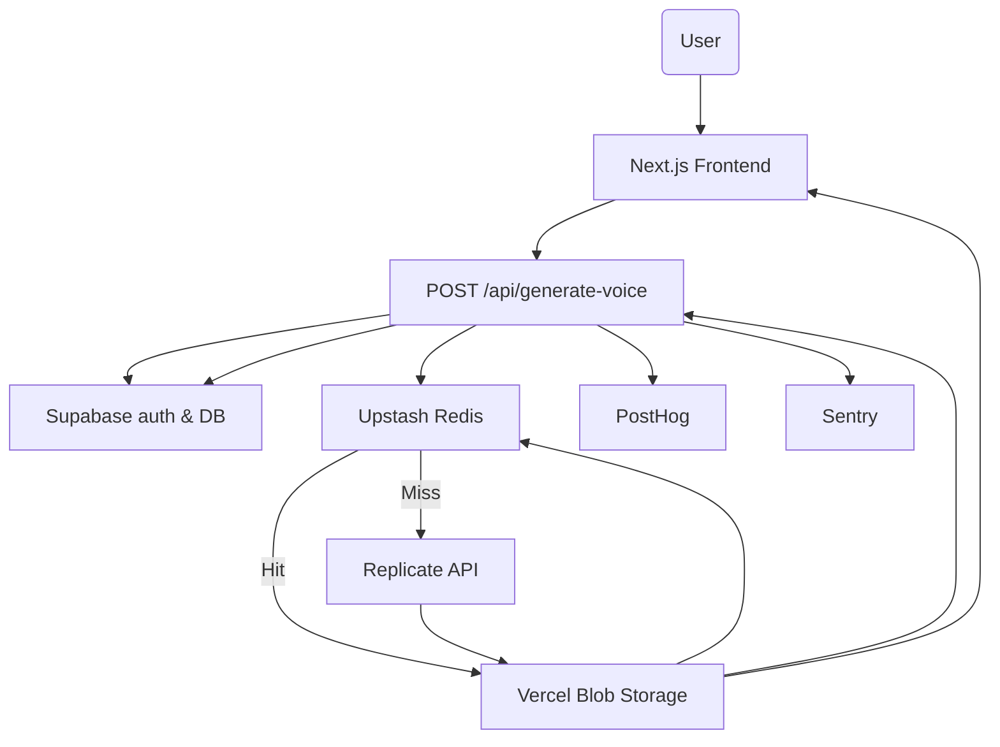

# Architecture Overview

This document outlines the high level architecture of **SexyVoice.ai** and how data flows through the system.

## Key Components

- **Next.js App Router** – renders the frontend and hosts API routes.
- **Supabase** – provides authentication and PostgreSQL database.
- **Replicate** – generates voice audio from text.
- **Vercel Blob Storage** – stores generated audio files.
- **Upstash Redis** – caches audio URLs for repeated requests.
- **PostHog** – captures analytics events.
- **Sentry** – tracks errors and exceptions.

## Voice Generation Flow

1. The frontend calls `POST /api/generate-voice` with the text and voice name.
2. The API route validates the request and checks user credits in **Supabase**.
3. The request hash is looked up in **Redis**; if found, the cached URL is returned.
4. Otherwise the route invokes **Replicate** to synthesize audio and uploads it to **Vercel Blob Storage**.
5. The blob URL is cached in **Redis** and stored in **Supabase** along with metadata and credit usage.
6. Analytics are sent to **PostHog** and any errors are logged in **Sentry**.
7. The API returns the final audio URL to the client.
