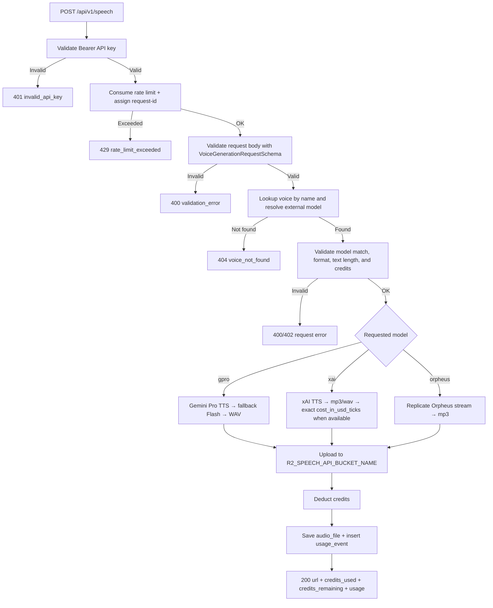
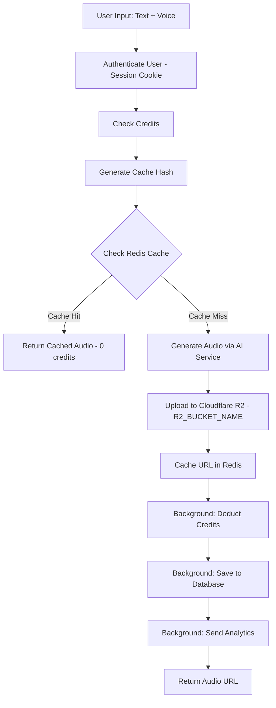
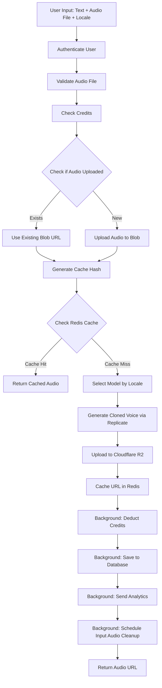
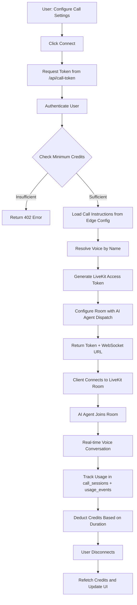

# Architecture Overview

This document outlines the high-level architecture of **SexyVoice.ai** and how data flows through the system.

> For detailed development guidelines, see [AGENTS.md](./AGENTS.md).
> For setup instructions and features, see [README.md](./README.md).

## Overview

SexyVoice.ai is a modern AI voice generation platform built with Next.js, TypeScript, and Supabase. The platform enables users to generate AI voices, clone voices, and manage a library of generated audio content using a credit-based system with support for 20+ languages.

## Key Components

- **Next.js App Router** – React framework with Server Components (RSCs), Suspense, and Server Actions
- **Supabase** – Authentication (OAuth with Google) and PostgreSQL database with SSR support
- **Replicate** – AI voice generation from text (pre-made voices and voice cloning)
- **fal.ai** – Alternative voice cloning service *(optional)*
- **Google Generative AI** – Text-to-speech via Gemini 2.5 Pro/Flash TTS, text enhancement, and automatic emotion tagging
- **xAI Grok** – Text-to-speech via Grok TTS API with multi-language support (mp3/wav output)
- **LiveKit** – Real-time voice communication with WebRTC for AI voice calls
- **Cloudflare R2** – Scalable storage for generated audio files; two buckets: `R2_BUCKET_NAME` (dashboard) and `R2_SPEECH_API_BUCKET_NAME` (external API)
- **Upstash Redis** – High-performance caching for audio URLs (dashboard/clone flows); rate limiting for external API keys
- **Vercel Edge Config** – Dynamic configuration for call instructions and presets
- **Stripe** – Payment processing, credit top-ups, subscription management
- **Sentry** – Error tracking and performance monitoring
- **PostHog** – Product analytics and feature flags
- **Axiom** – Structured request logging for external API routes
- **Inngest** – Background job processing and scheduled tasks
- **External REST API** – public `/api/v1/*` speech, voices, models, billing, and OpenAPI endpoints with HMAC-keyed API keys, rate limiting, and shared request/response helpers

## External REST API

Base path: `/api/v1/`

The external API is the public programmatic surface for third-party
integrations. It currently exposes one generation endpoint
(`POST /api/v1/speech`) and four metadata/discovery endpoints
(`GET /api/v1/voices`, `GET /api/v1/models`, `GET /api/v1/billing`, and public
`GET /api/v1/openapi`). The authenticated endpoints share API-key auth,
request-id generation, rate-limit headers, structured errors, and persistence
helpers from `apps/web/lib/api/`.

### Authentication and key lifecycle

All `/api/v1/*` endpoints except `GET /api/v1/openapi` require an
`Authorization: Bearer sk_live_…` header.

- Keys are created in Dashboard → API Keys via `/api/api-keys`
- Keys are stored as HMAC-SHA256 hashes using `API_KEY_HMAC_SECRET`
- Users can have up to 10 active API keys
- `validateApiKey()` resolves `userId`, `apiKeyId`, and `keyHash`
- `updateApiKeyLastUsed()` runs in a `finally` block on authenticated routes so
  last-use metadata updates on both success and failure

### Endpoint surface

| Method | Path | Purpose | Notes |
|--------|------|---------|-------|
| `POST` | `/api/v1/speech` | Generate speech audio and persist billing/usage | Always fresh generation, no cache; uploads to `R2_SPEECH_API_BUCKET_NAME` |
| `GET` | `/api/v1/voices` | List public TTS voices | Returns `id`, `name`, `language`, `model`, `formats`, `supports_style` |
| `GET` | `/api/v1/models` | List the external model catalog | Backed by `EXTERNAL_API_MODELS` with max input lengths and supported formats |
| `GET` | `/api/v1/billing` | Return credits and the latest billing transaction | Latest transaction is limited to `purchase` / `topup` types |
| `GET` | `/api/v1/openapi` | Return the OpenAPI 3.1 document | Public endpoint; no API-key auth or API-key rate limiting |

### Model capabilities

The public speech request currently accepts `model` values `gpro`, `orpheus`,
and `xai`.

| Request model | Provider | Max input length | Formats | Parameter behavior |
|--------------|----------|------------------|---------|--------------------|
| `gpro` | Google Gemini TTS | 1000 chars | `wav` | `style` is prepended to the input; `seed` is supported |
| `orpheus` | Replicate Orpheus | 500 chars | `mp3` | `style` is ignored |
| `xai` | xAI Grok TTS | 1000 chars | `mp3`, `wav` | `style` is ignored; language is normalized from the voice locale |

The route layer maps DB model names to external IDs in `lib/api/model.ts`; keep
`EXTERNAL_API_MODELS`, route validation, schemas, and docs aligned whenever the
catalog changes.

### Success and error conventions

All authenticated `/api/v1/*` responses, including structured errors, include:

- `X-RateLimit-Limit-Requests`
- `X-RateLimit-Remaining-Requests`
- `X-RateLimit-Reset-Requests`
- `request-id` — prefixed `req_sv_` UUID for tracing

`GET /api/v1/openapi` is the only v1 endpoint that currently skips this shared
response wrapper.

`POST /api/v1/speech` returns a hosted audio `url`, `credits_used`,
`credits_remaining`, and a `usage` object with `input_characters` and the model
used for generation.

`GET /api/v1/billing` returns:

- `creditsLeft`
- `lastUpdated`
- `userId`
- `lastBillingTransaction`

All errors follow a consistent nested structure:

```json
{
  "error": {
    "message": "Human-readable description",
    "type": "authentication_error | invalid_request_error | rate_limit_error | server_error | permission_error | not_found_error",
    "param": "offending_field_or_null",
    "code": "machine_readable_code"
  }
}
```

### Rate limiting and observability

Authenticated endpoints are limited to 60 requests/minute per API key via an
Upstash token bucket in `lib/api/rate-limit.ts`.

`/api/v1/speech` additionally emits structured logs through `createLogger()`
with `requestId`, `apiKeyId`, `userId`, provider/model, credit usage, and
dollar amount. Sentry captures failures across the v1 routes.

### External API Speech Generation Flow


```mermaid
flowchart TD
    A[POST /api/v1/speech] --> B[Validate Bearer API key]
    B -->|Invalid| Z1[401 invalid_api_key]
    B -->|Valid| C[Consume rate limit + assign request-id]
    C -->|Exceeded| Z2[429 rate_limit_exceeded]
    C -->|OK| D[Validate request body with VoiceGenerationRequestSchema]
    D -->|Invalid| Z3[400 validation_error]
    D -->|Valid| E[Lookup voice by name and resolve external model]
    E -->|Not found| Z4[404 voice_not_found]
    E -->|Found| F[Validate model match, format, text length, and credits]
    F -->|Invalid| Z5[400/402 request error]
    F -->|OK| G{Requested model}
    G -->|gpro| H[Gemini Pro TTS → fallback Flash → WAV]
    G -->|xai| I[xAI TTS → mp3/wav → exact cost_in_usd_ticks when available]
    G -->|orpheus| J[Replicate Orpheus stream → mp3]
    H --> K[Upload to R2_SPEECH_API_BUCKET_NAME]
    I --> K
    J --> K
    K --> L[Deduct credits]
    L --> M[Save audio_file + insert usage_event]
    M --> N[200 url + credits_used + credits_remaining + usage]
```

Key route behavior:

1. The request body is validated with `VoiceGenerationRequestSchema`.
2. Voice lookup is by public `voice` name; the route enforces that the
   requested `model` matches the resolved voice.
3. Text length uses `getCharactersLimit()` and paid status from
   `hasUserPaidAdmin()`.
4. Credit pre-check uses `estimateCredits()`; Gemini requests recalculate final
   billed credits from actual token usage when metadata is available.
5. xAI/Grok requests normalize language from the stored voice locale and, when
   xAI returns `cost_in_usd_ticks`, persist the exact USD cost instead of the
   fallback pricing table.
6. Every successful call saves an `audio_files` row and inserts a `usage_event`
   with `sourceType: 'api_tts'`, `apiKeyId`, dollar amount, and
   provider-specific metadata.

### Shared API Layer (`lib/api/`)

| File | Purpose |
|------|---------|
| `auth.ts` | `generateApiKey()`, `hashApiKey()`, `validateApiKey()`, `updateApiKeyLastUsed()` |
| `constants.ts` | External model catalog (`EXTERNAL_API_MODELS`) and default rate-limit settings |
| `errors.ts` | `createApiError()` and `zodErrorToApiError()` |
| `external-errors.ts` | Shared external error map, `getExternalApiRequestId()`, and `externalApiErrorResponse()` |
| `logger.ts` | Axiom-backed per-request structured logger via `createLogger()` |
| `model.ts` | DB-to-public model mapping, default formats, format support checks, and model catalog helpers |
| `openapi.ts` | `createExternalApiOpenApiDocument()` using `zod-openapi` |
| `pricing.ts` | Fallback estimated dollar amounts when the provider does not return an exact cost |
| `rate-limit.ts` | Upstash token-bucket limiting and response-header helpers |
| `responses.ts` | `jsonWithRateLimitHeaders()` for shared JSON responses |
| `schemas.ts` | Zod schemas for v1 request/response types shared by runtime validation and OpenAPI generation |

### Data access pattern

External API routes resolve `userId` from the API key, not a session cookie.
User-scoped/private reads and writes use admin access (`*Admin` queries or
`createAdminClient()`), while public catalog routes like `/api/v1/voices` may
use the regular server client when the query is explicitly constrained to
public rows.

Common user-scoped helpers include:

- `getCreditsAdmin(userId)`
- `getVoiceIdByNameAdmin(voiceName)`
- `hasUserPaidAdmin(userId)`
- `reduceCreditsAdmin({ userId, amount })`
- `saveAudioFileAdmin(params)`
- `insertUsageEvent(params)`

`GET /api/v1/billing` uses `createAdminClient()` directly because it reads from
both `credits` and `credit_transactions` for the API key owner.

## Voice Generation Flow (Dashboard)

API endpoint: `POST /api/generate-voice`


```mermaid
flowchart TD
    A[User Input: Text + Voice] --> B[Authenticate User - Session Cookie]
    B --> C[Check Credits]
    C --> D[Generate Cache Hash]
    D --> E{Check Redis Cache}
    E -->|Cache Hit| F[Return Cached Audio - 0 credits]
    E -->|Cache Miss| G[Generate Audio via AI Service]
    G --> H[Upload to Cloudflare R2 - R2_BUCKET_NAME]
    H --> I[Cache URL in Redis]
    I --> J[Background: Deduct Credits]
    J --> K[Background: Save to Database]
    K --> L[Background: Send Analytics]
    L --> M[Return Audio URL]
```

### Steps

1. **Frontend Validation**: User enters text (max 500 chars) and selects a voice
2. **API Authentication**: Verify user session via Supabase Auth
4. **Credit Check**: Query user's credit balance in Supabase (via session-scoped `createClient()`)
5. **Credit Estimation**: Calculate required credits based on text length
6. **Cache Lookup**: Generate hash from (text + voice + parameters) and check Redis
7. **Cache Hit**: Return cached audio URL immediately (0 credits used)
8. **Cache Miss**:
   - Call appropriate AI service (Replicate or Google Gemini TTS)
   - Generate audio from text
9. **Storage**: Upload generated audio to Cloudflare R2 (`R2_BUCKET_NAME`, served from `files.sexyvoice.ai`)
9. **Cache Update**: Store R2 URL in Redis for future requests
10. **Background Tasks** (using Next.js `after()`):
    - Deduct credits from user balance
    - Save audio metadata to database
    - Send analytics event to PostHog
11. **Response**: Return audio URL, credits used, and remaining balance

## Voice Cloning Flow

API endpoint: `POST /api/clone-voice`


```mermaid
flowchart TD
    A[User Input: Text + Audio File + Locale] --> B[Authenticate User]
    B --> C[Validate Audio File]
    C --> D[Check Credits]
    D --> E{Check if Audio Uploaded}
    E -->|Exists| F[Use Existing Blob URL]
    E -->|New| G[Upload Audio to Blob]
    F --> H[Generate Cache Hash]
    G --> H
    H --> I{Check Redis Cache}
    I -->|Cache Hit| J[Return Cached Audio]
    I -->|Cache Miss| K[Select Model by Locale]
    K --> L[Generate Cloned Voice via Replicate]
    L --> M[Upload to Cloudflare R2]
    M --> N[Cache URL in Redis]
    N --> O[Background: Deduct Credits]
    O --> P[Background: Save to Database]
    P --> Q[Background: Send Analytics]
    Q --> R[Background: Schedule Input Audio Cleanup]
    R --> S[Return Audio URL]
```

### Steps

1. **Frontend Validation**: User provides text (max 500 chars), uploads audio file, selects locale
2. **API Authentication**: Verify user session via Supabase Auth
3. **File Validation**:
   - Check MIME type (allowed: MP3, OGG, M4A, WAV)
   - Check file size (max 4.5MB)
   - Extract and validate audio duration (10 seconds to 5 minutes)
4. **Credit Check**: Query user's credit balance in Supabase
5. **Credit Estimation**: Calculate required credits (higher cost than regular generation)
6. **Audio Upload**:
   - Check if user's audio file already exists in R2 Storage
   - If not, upload to `clone-voice-input/{userId}-{sanitizedFilename}`
   - Use existing URL if already uploaded (based on filename)
7. **Cache Lookup**: Generate hash from (locale + text + audio blob URL) and check Redis
8. **Cache Hit**: Return cached cloned audio URL immediately (0 credits used)
9. **Cache Miss**:
   - Resolve provider based on locale:
     - Mistral Voxtral (`voxtral-mini-tts-2603`) for `ar`, `de`, `en`, `es`, `fr`, `hi`, `it`, `nl`, and `pt`
     - Replicate Chatterbox Multilingual (`resemble-ai/chatterbox-multilingual`) for all other supported clone locales: `da`, `el`, `en-multi`, `fi`, `he`, `ja`, `ko`, `ms`, `no`, `pl`, `ru`, `sv`, `sw`, `tr`, and `zh`
   - Generate cloned voice audio using the selected provider:
     - Mistral returns WAV audio directly from `audio.speech.complete()`
     - Replicate runs the multilingual Chatterbox model with the locale mapped to the provider language code (`en-multi` is sent as `en`)
10. **Fetch & Storage**: Upload generated audio to Cloudflare R2 as `clone-voice/{hash}.wav`
11. **Cache Update**: Store blob URL in Redis for future identical requests
12. **Background Tasks** (using Next.js `after()`):
    - Deduct credits from user balance
    - Save audio metadata to database (with voice_id for cloned voice)
    - Send analytics event to PostHog
    - Schedule cleanup of input audio file via Inngest (`clone-audio/cleanup.scheduled`)
13. **Response**: Return cloned audio URL, credits used, remaining balance, and input audio URL

### Voice Cloning Models

| Locale group | Locales | Model | Provider |
|--------------|---------|-------|----------|
| Voxtral-supported locales | `ar`, `de`, `en`, `es`, `fr`, `hi`, `it`, `nl`, `pt` | `voxtral-mini-tts-2603` | Mistral |
| Chatterbox multilingual locales | `da`, `el`, `en-multi`, `fi`, `he`, `ja`, `ko`, `ms`, `no`, `pl`, `ru`, `sv`, `sw`, `tr`, `zh` | `resemble-ai/chatterbox-multilingual` | Replicate |

### File Constraints

- **Allowed formats**: MP3, OGG, M4A, WAV
- **Max file size**: 4.5MB
- **Duration**: 10 seconds minimum, 5 minutes maximum
- **Storage**: Input audio temporarily stored, then cleaned up via background job

## Real-time AI Voice Call Flow

API endpoint: `POST /api/call-token`


```mermaid
flowchart TD
    A[User: Configure Call Settings] --> B[Click Connect]
    B --> C[Request Token from /api/call-token]
    C --> D[Authenticate User]
    D --> E{Check Minimum Credits}
    E -->|Insufficient| F[Return 402 Error]
    E -->|Sufficient| G[Load Call Instructions from Edge Config]
    G --> H[Resolve Voice by Name]
    H --> I[Generate LiveKit Access Token]
    I --> J[Configure Room with AI Agent Dispatch]
    J --> K[Return Token + WebSocket URL]
    K --> L[Client Connects to LiveKit Room]
    L --> M[AI Agent Joins Room]
    M --> N[Real-time Voice Conversation]
    N --> O[Track Usage in call_sessions + usage_events]
    O --> P[Deduct Credits Based on Duration]
    P --> Q[User Disconnects]
    Q --> R[Refetch Credits and Update UI]
```

### Steps

1. **Configure Session**: User selects voice, model, temperature, and custom instructions in `/dashboard/call`
2. **Request Token**: Frontend calls `/api/call-token` with session configuration
3. **Authentication**: Verify user session via Supabase Auth
4. **Credit Check**: Ensure user has minimum credits required for calls
5. **Load Instructions**: Fetch dynamic call instructions from Vercel Edge Config (with fallback defaults)
6. **Voice Resolution**: Look up voice ID by name from database
7. **Token Generation**: Create LiveKit access token with:
   - Room grants (join, publish, subscribe)
   - Room configuration with AI agent dispatch (`sexycall` agent)
   - Metadata containing instructions, model, voice, and user context
8. **Client Connection**: Return access token and WebSocket URL to client
9. **Room Join**: Client connects to LiveKit room using WebRTC
10. **AI Agent**: Agent joins room and handles real-time voice conversation
11. **Usage Tracking**: Record session in `call_sessions` table, events in `usage_events`
12. **Billing**: Deduct credits based on call duration
13. **Disconnect**: On call end, refresh credits and update UI

### Call Configuration Options

| Setting | Description | Default |
|---------|-------------|---------|
| Voice | AI voice for the call | Configurable |
| Model | LLM model for conversation | gpt-4o-realtime |
| Temperature | Response creativity (0-1) | 0.8 |
| Max Output Tokens | Token limit for responses | 4096 |
| Instructions | System prompt for AI behavior | From Edge Config |
| Language | Conversation language | English |

## Database Schema

### Core Tables

- `profiles` – User profiles linked to Supabase Auth users
- `voices` – Voice models (system voices and user-created cloned voices)
- `audio_files` – Generated audio files with metadata (text, URL, duration, credits used)
- `credits` – User credit balances
- `credit_transactions` – Credit usage and purchase history
- `call_sessions` – Real-time voice call sessions with duration, room ID, and billing info
- `usage_events` – Granular usage tracking for analytics, billing, and reporting
- `api_keys` – External API keys; stores `key_hash` (HMAC-SHA256), `key_prefix` (first 12 chars for display), `is_active`, `expires_at`, `permissions` (JSONB scopes), `last_used_at`

See [AGENTS.md](./AGENTS.md) for detailed schema definitions.

## Caching Strategy

### Redis Cache Layer (Upstash)

Used by the **dashboard** voice generation and voice cloning flows only. The external API (`/api/v1/speech`) always generates fresh audio and does not use the cache.

- **Cache Key**: SHA-256 hash of request parameters (first 8 chars)
  - Voice Generation: `locale + text + voice + parameters`
  - Voice Cloning: `locale + text + audio_blob_url`
- **TTL**: Persistent (no expiration)
- **Cache Hit**: Returns audio URL immediately with 0 credit cost
- **Cache Miss**: Generates new audio, uploads to R2, stores URL in cache
- **Benefits**:
  - Reduces AI API costs for repeated requests
  - Improves response time for common queries
  - Enables identical request deduplication across users

### Rate Limiting (Upstash Ratelimit)

Used by the **external API** (`/api/v1/*`) only. Token bucket algorithm, keyed by API key hash.

- **Limit**: 60 requests/minute per API key (configurable via `RATE_LIMIT_DEFAULT`)
- **Headers**: `X-RateLimit-Limit-Requests`, `X-RateLimit-Remaining-Requests`, `X-RateLimit-Reset-Requests` on every response

## Application Structure

```
app/[lang]/                    # Internationalized routes (en, es, de, da, it, fr)
├── (auth)/                    # Public authentication pages
├── (dashboard)/               # Protected dashboard routes
│   └── dashboard/
│       ├── call/              # Real-time AI voice call interface
│       ├── usage/             # Usage statistics dashboard
│       ├── generate/          # Voice generation
│       ├── clone/             # Voice cloning
│       └── history/           # Generated audio history
├── actions/                   # Server actions (promos, stripe)
├── blog/[slug]/               # MDX blog posts
└── page.tsx                   # Landing page

app/api/
├── api-keys/                  # API key management (list, create) — requires paid account
│   └── [id]/                  # Deactivate a specific key (DELETE)
├── call-token/                # LiveKit token generation for real-time calls
├── usage-events/              # Usage tracking API
├── daily-stats/               # Daily statistics endpoint
├── generate-voice/            # Voice generation endpoint (dashboard, session-auth)
├── clone-voice/               # Voice cloning endpoint
├── stripe/webhook/            # Stripe payment webhooks
├── v1/                        # External REST API (API-key auth, rate-limited)
│   ├── billing/               # GET  – credit balance + last transaction
│   ├── models/                # GET  – model catalog
│   ├── openapi/               # GET  – OpenAPI 3.1 spec (public, no auth)
│   ├── speech/                # POST – text-to-speech generation
│   └── voices/                # GET  – list public TTS voices
└── cron/telegram/             # Daily stats notifications

lib/
├── api/                       # External API shared layer
│   ├── auth.ts                # API key generation, HMAC hashing, validateApiKey()
│   ├── constants.ts           # EXTERNAL_API_MODELS catalog, RATE_LIMIT_DEFAULT
│   ├── errors.ts              # createApiError(), zodErrorToApiError()
│   ├── external-errors.ts     # Structured error definitions + externalApiErrorResponse()
│   ├── logger.ts              # Axiom-backed per-request structured logger
│   ├── model.ts               # resolveExternalModelId(), getDefaultFormat(), isFormatSupported()
│   ├── openapi.ts             # createExternalApiOpenApiDocument() via zod-openapi
│   ├── pricing.ts             # calculateExternalApiDollarAmount()
│   ├── rate-limit.ts          # consumeRateLimit() — Upstash token bucket
│   ├── responses.ts           # jsonWithRateLimitHeaders()
│   └── schemas.ts             # Zod schemas (shared with OpenAPI generator)
├── supabase/
│   ├── admin.ts               # createAdminClient() — service role, bypasses RLS
│   ├── queries.ts             # DB queries; *Admin variants for external API routes
│   └── server.ts              # createClient() — anon key, session-scoped
├── storage/
│   └── upload.ts              # uploadFileToR2(filename, buffer, contentType, bucketName, publicBaseUrl)
├── i18n/                      # Internationalization (en, es, de, da, it, fr)
├── stripe/                    # Payment processing
├── edge-config/               # Vercel Edge Config for dynamic settings
├── inngest/                   # Background jobs
└── utils/                     # Utility functions

data/
├── playground-state.ts        # Call session state management
├── presets.ts                 # Preset configurations for calls
├── voices.ts                  # Voice definitions for calls
├── session-config.ts          # Session configuration
└── default-config.ts          # Default call instructions

hooks/
├── use-connection.tsx         # LiveKit connection management
├── use-agent.tsx              # AI agent interaction hook
├── use-call-timer.ts          # Call duration tracking
├── use-playground-state.tsx   # Call state management
└── use-persistent-media-device.ts  # Microphone persistence

components/
├── ui/                        # shadcn/ui components
├── call/                      # Real-time call components (voice selector, chat, controls)
└── [features]/                # Feature-specific components
```

tests/
├── setup.ts                   # Global Vitest setup — env vars, vi.mock() for all external deps
├── v1-speech.test.ts           # External speech API — auth, validation, Grok/Gemini/Replicate generation, credits
├── api-v1-meta.test.ts        # External models/voices/openapi endpoints
├── api-v1-billing.test.ts     # External billing endpoint
├── api-keys-routes.test.ts    # API key CRUD routes
└── *.test.ts                  # Other feature test suites

See [AGENTS.md](./AGENTS.md) for detailed application structure and development guidelines.
