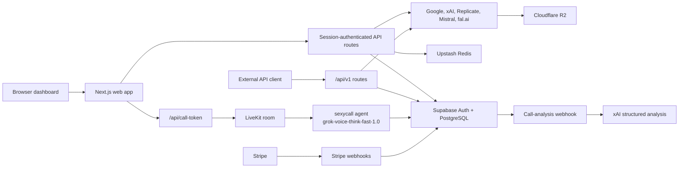
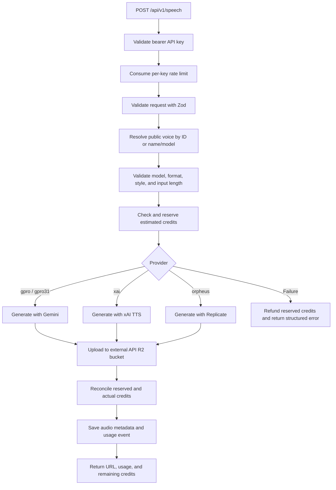
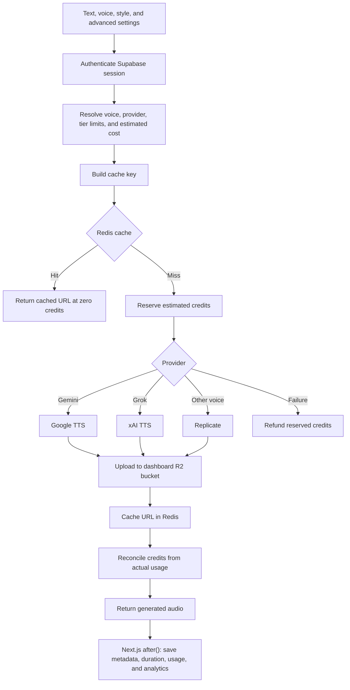
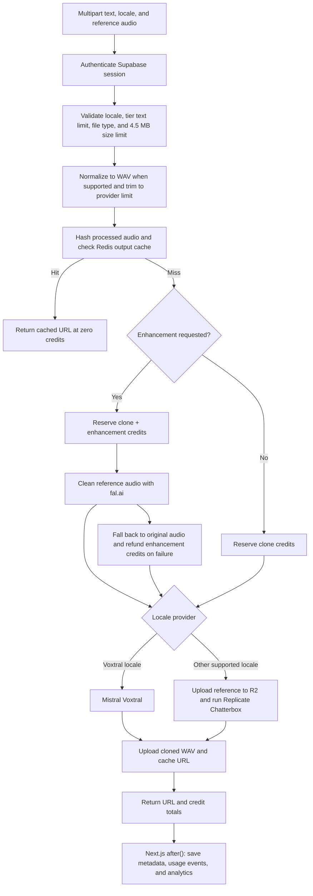
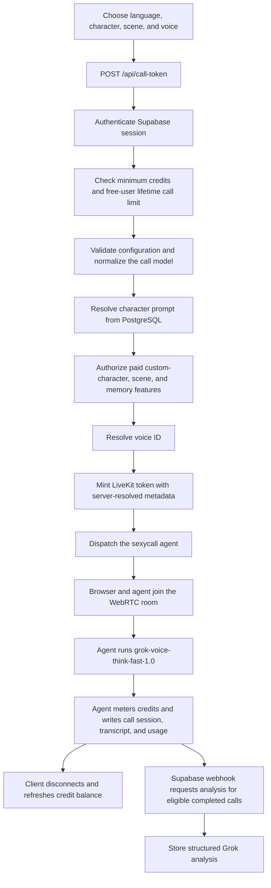

# Architecture Overview

SexyVoice.ai is a pnpm/Turborepo monorepo for AI speech generation, voice
cloning, and real-time AI voice calls. The product uses a credit ledger across
the dashboard, external API, and LiveKit call agent.

> See [AGENTS.md](./AGENTS.md) for development rules,
> [README.md](./README.md) for local setup, and
> [docs/devops.md](./docs/devops.md) for deployment and environment details.

## System Shape


```mermaid
flowchart LR
    Browser["Browser dashboard"] --> Web["Next.js web app"]
    Client["External API client"] --> V1["/api/v1 routes"]
    Web --> SessionRoutes["Session-authenticated API routes"]
    Web --> Token["/api/call-token"]
    SessionRoutes --> Providers["Google, xAI, Replicate, Mistral, fal.ai"]
    V1 --> Providers
    SessionRoutes --> Redis["Upstash Redis"]
    Providers --> R2["Cloudflare R2"]
    SessionRoutes --> Supabase["Supabase Auth + PostgreSQL"]
    V1 --> Supabase
    Token --> LiveKit["LiveKit room"]
    LiveKit --> Agent["sexycall agent<br/>grok-voice-think-fast-1.0"]
    Agent --> Supabase
    Supabase --> Analysis["Call-analysis webhook"]
    Analysis --> XAI["xAI structured analysis"]
    Stripe["Stripe"] --> Webhooks["Stripe webhooks"]
    Webhooks --> Supabase
```

The repository has three main workspaces:

- `apps/web` contains the Next.js 16 and React 19 product, route handlers,
  Supabase migrations, Vitest tests, and Playwright tests.
- `apps/docs` contains the Fumadocs site deployed at `docs.sexyvoice.ai`.
- `scripts` contains operational analysis, backfill, refund, and maintenance
  tools.

## Runtime Components

- **Next.js App Router** renders the localized product and runs server
  components, server actions, and route handlers.
- **Supabase** provides Google OAuth, PostgreSQL, RLS-protected user data, and
  privileged server access through `SUPABASE_SECRET_KEY`.
- **Google Generative AI** provides Gemini 2.5 and Gemini 3.1 TTS, text
  enhancement, and emotion tagging.
- **xAI** provides Grok TTS, the real-time call model, and structured call
  transcript analysis.
- **Replicate** runs Orpheus TTS and Chatterbox Multilingual voice cloning.
- **Mistral** runs Voxtral voice cloning for its supported locales.
- **fal.ai** optionally cleans voice-cloning reference audio with
  `fal-ai/deepfilternet3` before cloning.
- **LiveKit** carries WebRTC audio and dispatches the external `sexycall`
  agent.
- **Cloudflare R2** stores generated audio. Dashboard output uses
  `R2_BUCKET_NAME`; `/api/v1/speech` uses `R2_SPEECH_API_BUCKET_NAME`.
- **Upstash Redis** caches dashboard TTS and cloned output and rate-limits
  external API keys.
- **Vercel Edge Config** supplies default call instructions. Character prompts
  come from PostgreSQL and are resolved again when the server mints a token.
- **Stripe** manages subscriptions, top-ups, and credit purchases.
- **Sentry**, **PostHog**, and **Axiom** provide error tracking, product
  analytics, and external API request logs.

## Provider and Model Map

| Feature | Public or stored ID | Runtime provider/model | Notes |
| --- | --- | --- | --- |
| Dashboard TTS | `gpro` | Paid: `gemini-2.5-pro-preview-tts`; free: `gemini-2.5-flash-preview-tts` | Paid Pro failures fall back to Gemini 2.5 Flash |
| External API TTS | `gpro` | `gemini-2.5-pro-preview-tts` | Always generates fresh audio; falls back to Gemini 2.5 Flash |
| Dashboard and API TTS | `gpro31` | `gemini-3.1-flash-tts-preview` | Falls back to Gemini 2.5 Flash; dashboard streaming is currently disabled |
| Dashboard and API TTS | `xai` | xAI TTS API | Supports MP3/WAV and a `0.7`–`1.5` speed setting |
| Dashboard and API TTS | `orpheus` | Replicate Orpheus | External API aliases supported Orpheus model paths to `orpheus` |
| Voice cloning | Locale-dependent | Mistral `voxtral-mini-tts-2603` or Replicate Chatterbox Multilingual | See the cloning locale table below |
| Real-time calls | `grok-voice-think-fast-1.0` | xAI Grok Voice Agent | Current call model |
| Call transcript analysis | `XAI_SUMMARY_MODEL` or `grok-4.3` | xAI structured generation | Runs only for eligible completed calls |

## External REST API

Base path: `/api/v1/`

The external API lets third-party clients generate speech with API keys. It
does not share the dashboard's Redis audio cache; every speech request creates
fresh audio in the external API R2 bucket.

### Authentication

All endpoints except `GET /api/v1/openapi` require
`Authorization: Bearer sk_live_…`. The application stores HMAC-SHA256 hashes,
never raw keys, and displays a raw key only when it is created. API key
creation requires a paid account and allows at most 10 active keys per user.

### Endpoints

| Method | Path | Description |
| --- | --- | --- |
| `POST` | `/api/v1/speech` | Generate fresh speech audio |
| `GET` | `/api/v1/voices` | List public TTS voices and their model IDs |
| `GET` | `/api/v1/models` | List the `gpro`, `gpro31`, `xai`, and `orpheus` catalog |
| `GET` | `/api/v1/billing` | Return the credit balance and latest transaction |
| `GET` | `/api/v1/openapi` | Return the public OpenAPI 3.1 document |

Clients may select speech voices by `voiceId`, or by the `voice` and `model`
pair. Request and response schemas live in `apps/web/lib/api/schemas.ts` and
feed the OpenAPI generator.

### Error Shape

```json
{
  "error": {
    "message": "Human-readable description",
    "type": "authentication_error | invalid_request_error | rate_limit_error | server_error | permission_error | not_found_error",
    "param": "offending_field_or_null",
    "code": "machine_readable_code"
  }
}
```

Authenticated endpoints use a 60-request-per-minute token bucket keyed by API
key hash. Responses include `X-RateLimit-Limit-Requests`,
`X-RateLimit-Remaining-Requests`, `X-RateLimit-Reset-Requests`, and a
`req_sv_`-prefixed `request-id`.

### Speech Flow


```mermaid
flowchart TD
    A["POST /api/v1/speech"] --> B["Validate bearer API key"]
    B --> C["Consume per-key rate limit"]
    C --> D["Validate request with Zod"]
    D --> E["Resolve public voice by ID or name/model"]
    E --> F["Validate model, format, style, and input length"]
    F --> G["Check and reserve estimated credits"]
    G --> H{"Provider"}
    H -->|"gpro / gpro31"| I["Generate with Gemini"]
    H -->|"xai"| J["Generate with xAI TTS"]
    H -->|"orpheus"| K["Generate with Replicate"]
    I --> L["Upload to external API R2 bucket"]
    J --> L
    K --> L
    L --> M["Reconcile reserved and actual credits"]
    M --> N["Save audio metadata and usage event"]
    N --> O["Return URL, usage, and remaining credits"]
    H -->|"Failure"| P["Refund reserved credits and return structured error"]
```

Routes whose user identity comes from an API key use the server-only admin
query variants for user-scoped data. Public voice listing uses the regular
Supabase client and public RLS policy. Never expose `SUPABASE_SECRET_KEY` to a
browser or use it in a `NEXT_PUBLIC_` variable.

## Dashboard Voice Generation

Endpoint: `POST /api/generate-voice`


```mermaid
flowchart TD
    A["Text, voice, style, and advanced settings"] --> B["Authenticate Supabase session"]
    B --> C["Resolve voice, provider, tier limits, and estimated cost"]
    C --> D["Build cache key"]
    D --> E{"Redis cache"}
    E -->|"Hit"| F["Return cached URL at zero credits"]
    E -->|"Miss"| G["Reserve estimated credits"]
    G --> H{"Provider"}
    H -->|"Gemini"| I["Google TTS"]
    H -->|"Grok"| J["xAI TTS"]
    H -->|"Other voice"| K["Replicate"]
    I --> L["Upload to dashboard R2 bucket"]
    J --> L
    K --> L
    L --> M["Cache URL in Redis"]
    M --> N["Reconcile credits from actual usage"]
    N --> O["Return generated audio"]
    O --> P["Next.js after(): save metadata, duration, usage, and analytics"]
    H -->|"Failure"| Q["Refund reserved credits"]
```

The route enforces model- and tier-specific text limits: 500 characters by
default and 1,000 for paid Gemini and Grok requests. Gemini accepts style,
seed, and temperature; seed and temperature require a paid account. Grok
accepts a speech-speed multiplier. Provider-affecting advanced settings create
distinct cache keys.

The route reserves credits atomically before generation. On success it
reconciles the estimate with Gemini's token usage when available; on failure
it restores the reservation. Database and analytics writes run after the
response, but billing does not.

## Voice Cloning

Endpoint: `POST /api/clone-voice`


```mermaid
flowchart TD
    A["Multipart text, locale, and reference audio"] --> B["Authenticate Supabase session"]
    B --> C["Validate locale, tier text limit, file type, and 4.5 MB size limit"]
    C --> D["Normalize to WAV when supported and trim to provider limit"]
    D --> E["Hash processed audio and check Redis output cache"]
    E -->|"Hit"| F["Return cached URL at zero credits"]
    E -->|"Miss"| G{"Enhancement requested?"}
    G -->|"Yes"| H["Reserve clone + enhancement credits"]
    H --> I["Clean reference audio with fal.ai"]
    I --> J["Fall back to original audio and refund enhancement credits on failure"]
    G -->|"No"| K["Reserve clone credits"]
    I --> L{"Locale provider"}
    J --> L
    K --> L
    L -->|"Voxtral locale"| M["Mistral Voxtral"]
    L -->|"Other supported locale"| N["Upload reference to R2 and run Replicate Chatterbox"]
    M --> O["Upload cloned WAV and cache URL"]
    N --> O
    O --> P["Return URL and credit totals"]
    P --> Q["Next.js after(): save metadata, usage events, and analytics"]
```

### Locale Routing

| Locale group | Locales | Model | Provider |
| --- | --- | --- | --- |
| Voxtral | `ar`, `de`, `en`, `es`, `fr`, `hi`, `it`, `nl`, `pt` | `voxtral-mini-tts-2603` | Mistral |
| Chatterbox Multilingual | `da`, `el`, `en-multi`, `fi`, `he`, `ja`, `ko`, `ms`, `no`, `pl`, `ru`, `sv`, `sw`, `tr`, `zh` | `resemble-ai/chatterbox-multilingual` | Replicate |

Voxtral accepts 1,000 text characters for free users and 4,000 for paid users;
Chatterbox accepts 300. Reference audio must be at least 3 seconds for Voxtral
and 10 seconds for Chatterbox. Longer references are trimmed to 25 seconds for
Voxtral or 10 seconds for Chatterbox when conversion permits.

Accepted uploads include MP3, OGG/Opus, M4A, and WAV. Browser-recorded WebM is
converted to WAV in the client; the route rejects unconverted WebM. The route
normalizes other supported files to WAV. Only the Replicate path uploads a
reference file to R2 because Chatterbox requires a fetchable URL; Mistral
receives reference audio directly.

Optional fal.ai enhancement has separate duration and size safeguards and adds
an `audio_processing` usage event. Clone credits are reserved before provider
work and restored if generation fails. Background work saves metadata and
analytics; it does not perform billing or schedule an Inngest cleanup job.

## Real-time AI Voice Calls

Endpoint: `POST /api/call-token`


```mermaid
flowchart TD
    A["Choose language, character, scene, and voice"] --> B["POST /api/call-token"]
    B --> C["Authenticate Supabase session"]
    C --> D["Check minimum credits and free-user lifetime call limit"]
    D --> E["Validate configuration and normalize the call model"]
    E --> F["Resolve character prompt from PostgreSQL"]
    F --> G["Authorize paid custom-character, scene, and memory features"]
    G --> H["Resolve voice ID"]
    H --> I["Mint LiveKit token with server-resolved metadata"]
    I --> J["Dispatch the sexycall agent"]
    J --> K["Browser and agent join the WebRTC room"]
    K --> L["Agent runs grok-voice-think-fast-1.0"]
    L --> M["Agent meters credits and writes call session, transcript, and usage"]
    M --> N["Client disconnects and refreshes credit balance"]
    M --> O["Supabase webhook requests analysis for eligible completed calls"]
    O --> P["Store structured Grok analysis"]
```

The token route accepts 20 call languages. It requires at least 1,000 credits;
free users also have a five-minute lifetime call allowance. The current billed
rate is 1,000 credits per minute.

Public character prompt text never reaches the browser. The token route loads
it with an admin query, chooses the requested localized prompt or English
fallback, and places the result in LiveKit token metadata. Custom characters,
custom scenes, and the long-term memory backend require a paid account. Memory
is off by default, and its UI toggle is currently hidden.

### Call Configuration

| Setting | Current behavior |
| --- | --- |
| Model | `grok-voice-think-fast-1.0` |
| Voice | Stored per character, selected from public call voices, and resolved to a database ID |
| Temperature | Defaults to `0.8`; accepted range is `0`–`1.2` |
| Max output tokens | Nullable; defaults to the agent's model behavior |
| Instructions | Edge Config defaults for non-character calls; database prompts for characters |
| Language | 20 supported call languages; English fallback |
| Memory | Paid, opt-in backend; off by default |

Completed calls of at least 120 seconds with a transcript are eligible for
structured analysis. A Supabase Database Webhook authenticates to
`/api/call-sessions/analyze` with `CALL_SUMMARY_SECRET`. The route is idempotent
and writes one `call_session_analysis` row per session.

## Data and Storage

### Core PostgreSQL Tables

- `profiles` stores application users linked to Supabase Auth.
- `voices` stores public TTS/call voices and user-created voices.
- `prompts` and `characters` store localized call personalities and session
  configuration.
- `audio_files` stores generated-audio metadata, R2 URLs, duration, model, and
  billed credits.
- `credits` and `credit_transactions` store balances and purchases.
- `usage_events` stores normalized metering for dashboard TTS, API TTS, voice
  cloning, audio processing, and live calls.
- `api_keys` stores HMAC hashes, display prefixes, scopes, expiry, and last-use
  timestamps.
- `call_sessions` stores call duration, billing, transcript, model, and status.
- `call_session_analysis` stores one structured transcript analysis per call;
  `call_session_analytics` stores aggregate analysis runs.
- `agent_memories` stores pgvector-backed, per-user call memories with hybrid
  semantic and keyword retrieval.

See `apps/web/supabase/migrations/` and
`apps/web/lib/supabase/types.d.ts` for the complete schema.

### Supabase Access Boundaries

- Browser and session-authenticated server code use
  `apps/web/lib/supabase/server.ts` or the browser client and rely on RLS.
- Trusted server routes use `createAdminClient()` only when a service identity
  must access another user's rows, such as resolving an API key owner or a
  protected character prompt.
- `NEXT_PUBLIC_SUPABASE_PUBLISHABLE_KEY` is safe for the browser.
  `SUPABASE_SECRET_KEY` bypasses RLS and must remain server-only.

### R2 Buckets

- Dashboard TTS, cloning output, and Replicate reference uploads use
  `R2_BUCKET_NAME`.
- External API speech uses `R2_SPEECH_API_BUCKET_NAME` and its dedicated public
  base URL.
- PostgreSQL stores metadata and URLs; binary audio lives in R2.

## Caching and Rate Limiting

Dashboard TTS and voice cloning use persistent Redis entries with no explicit
TTL. Cache hits return the existing URL and consume zero credits.

- TTS keys use a SHA-256 digest of the rendered text, voice, effective model,
  seed, temperature, and speed. The stored digest is truncated to eight hex
  characters.
- Clone keys use locale, provider, text, processed reference-audio hash, and
  enhancement mode.
- Paid and free dashboard TTS outputs use separate R2 path prefixes.
- `/api/v1/speech` bypasses this cache and always generates fresh audio.

External API rate limiting uses an Upstash token bucket with a capacity and
refill rate of 60 requests per minute per API key hash.

## Repository Map

```text
apps/
├── web/
│   ├── app/[lang]/                    # Localized product routes
│   │   ├── (auth)/                    # Login and signup
│   │   ├── (dashboard)/dashboard/     # Generate, clone, call, usage, billing
│   │   ├── blog/                      # Contentlayer-backed blog
│   │   └── tools/                     # Browser audio utilities
│   ├── app/api/
│   │   ├── generate-voice/            # Dashboard TTS
│   │   ├── clone-voice/               # Dashboard voice cloning
│   │   ├── call-token/                # LiveKit token and agent dispatch
│   │   ├── call-sessions/analyze/     # Webhook-triggered transcript analysis
│   │   ├── characters/                # Custom character CRUD
│   │   ├── memories/                  # User memory erasure
│   │   ├── api-keys/                  # External API key management
│   │   ├── billing/                   # Dashboard API usage billing
│   │   ├── stripe/                    # Checkout and webhooks
│   │   └── v1/                        # External REST API
│   ├── components/                    # Shared and feature UI
│   ├── data/                          # Call models, voices, scenes, defaults
│   ├── hooks/                         # Call, audio, and client state
│   ├── lib/                           # API, Supabase, storage, AI, and billing
│   ├── messages/                      # next-intl locale files
│   ├── supabase/migrations/           # PostgreSQL schema and RLS
│   ├── tests/                         # Vitest tests
│   └── e2e/                           # Playwright tests
├── docs/
│   ├── content/                       # Fumadocs MDX content
│   └── src/                           # Docs app and OpenAPI generation
scripts/                               # Analysis, backfill, refund, and maintenance tools
```
