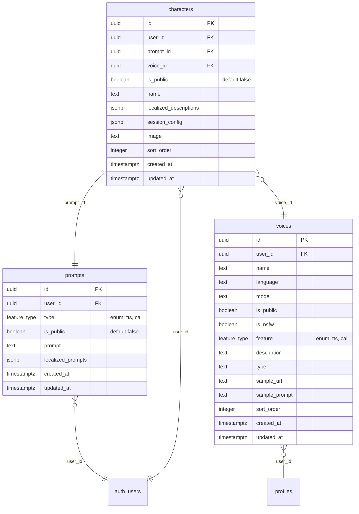
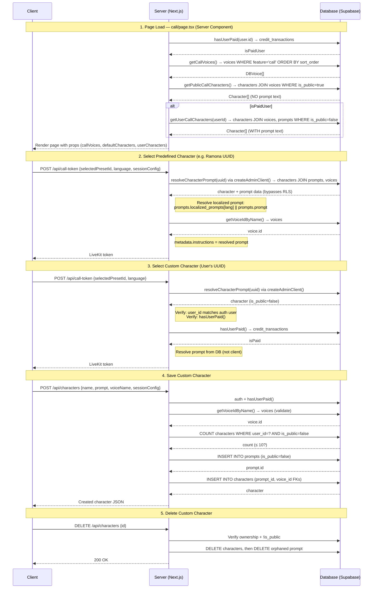

# Implementation Plan (v4): Characters + Prompts + DB-Driven Voices

## Summary of Changes from v3

| Area | v3 | v4 |
|------|-----|-----|
| Tables | Single `prompts` table with `is_public` | **Two tables**: `prompts` (prompt content) + `characters` (presentation/metadata) |
| Character metadata | Stored on `prompts` table | **Moved to `characters`** table (name, descriptions, image, voice, session_config) |
| Public/private | `prompts.is_public` | **Both** `characters.is_public` and `prompts.is_public` — characters table owns the public/private distinction; prompts mirror it so public prompt data is readable by anyone via RLS |
| Prompt → Character | 1:1 implicit | **Explicit FK**: `characters.prompt_id → prompts.id` |
| `voices.sort_order` | Not present | **Added** `sort_order INTEGER` column |
| Prompt resolution in `call-token` | User's Supabase client | **Admin client** (`createAdminClient()`) for prompt lookup — bypasses RLS, predefined prompt text never exposed |
| Enum types | Plain TEXT columns | **Shared DB enum**: `feature_type` (`'tts'`, `'call'`) used by both `voices.feature` and `prompts.type` |
| RLS performance | `auth.uid()` per-row | **Optimized**: `(select auth.uid())` cached subquery pattern on all policies |

---

## Database Schema (ERD)



---

## Phase 1: Database Migrations

### 1a. Migration: Enum types + `voices` table — add `feature`, `description`, `type`, `sort_order`

```sql
-- Migration: YYYYMMDDHHMMSS_voices_add_feature_desc_type_sort.sql

-- ─── Enum type ───
-- Single shared enum for the product feature a voice or prompt belongs to
CREATE TYPE public.feature_type AS ENUM ('tts', 'call');

-- ─── voices table changes ───
-- Add feature column using the shared enum type
ALTER TABLE public.voices
ADD COLUMN feature public.feature_type NOT NULL DEFAULT 'tts';

-- Backfill: xai model voices are call voices
UPDATE public.voices SET feature = 'call' WHERE model = 'xai';

-- Add description column (moved from hardcoded data/voices.ts)
ALTER TABLE public.voices
ADD COLUMN description text;

-- Add type column: 'Female', 'Male', 'Neutral' (moved from hardcoded data/voices.ts)
ALTER TABLE public.voices
ADD COLUMN type text;

-- Add sort_order for stable ordering
ALTER TABLE public.voices
ADD COLUMN sort_order integer NOT NULL DEFAULT 0;

-- Backfill the 5 xai call voices with description + type + sort_order:
UPDATE public.voices SET description = 'Default voice, balanced and conversational', type = 'Female', sort_order = 0
  WHERE name = 'Ara' AND model = 'xai';
UPDATE public.voices SET description = 'Professional and articulate, ideal for business applications', type = 'Male', sort_order = 1
  WHERE name = 'Rex' AND model = 'xai';
UPDATE public.voices SET description = 'Versatile voice suitable for various contexts', type = 'Neutral', sort_order = 2
  WHERE name = 'Sal' AND model = 'xai';
UPDATE public.voices SET description = 'Engaging and enthusiastic, great for interactive experiences', type = 'Female', sort_order = 3
  WHERE name = 'Eve' AND model = 'xai';
UPDATE public.voices SET description = 'Decisive and commanding, suitable for instructional content', type = 'Male', sort_order = 4
  WHERE name = 'Leo' AND model = 'xai';

-- Indexes
CREATE INDEX voices_feature_idx ON public.voices (feature);
CREATE INDEX voices_sort_order_idx ON public.voices (sort_order);
```

### 1b. Migration: Create `prompts` table

```sql
-- Migration: YYYYMMDDHHMMSS_create_prompts.sql

CREATE TABLE public.prompts (
  id uuid PRIMARY KEY DEFAULT gen_random_uuid(),
  user_id uuid REFERENCES auth.users(id) ON DELETE CASCADE NOT NULL,

  -- Prompt type discriminator using shared enum (extensible: 'call' now, 'tts' future, etc.)
  type public.feature_type NOT NULL,

  -- Whether this prompt is publicly readable (true for predefined character prompts)
  is_public boolean NOT NULL DEFAULT false,

  -- Prompt content
  prompt text NOT NULL DEFAULT '',                 -- English / fallback
  localized_prompts jsonb DEFAULT '{}'::jsonb,     -- { "es": "...", "de": "..." }

  created_at timestamptz DEFAULT now(),
  updated_at timestamptz DEFAULT now()
);

-- Indexes
CREATE INDEX prompts_user_id_idx ON public.prompts (user_id);
CREATE INDEX prompts_type_idx ON public.prompts (type);
CREATE INDEX prompts_is_public_idx ON public.prompts (is_public);

-- RLS
ALTER TABLE public.prompts ENABLE ROW LEVEL SECURITY;

-- SELECT: users can see their own prompts + all public prompts
-- Public prompts (is_public = true) are readable by anyone (e.g. predefined character prompts).
-- NOTE: (select auth.uid()) is wrapped in a subquery so it is evaluated once per query, not per row.
CREATE POLICY "Users can view own and public prompts"
  ON public.prompts FOR SELECT
  USING ((select auth.uid()) = user_id OR is_public = true);

CREATE POLICY "Users can insert own prompts"
  ON public.prompts FOR INSERT
  WITH CHECK ((select auth.uid()) = user_id);

CREATE POLICY "Users can update own prompts"
  ON public.prompts FOR UPDATE
  USING ((select auth.uid()) = user_id);

CREATE POLICY "Users can delete own prompts"
  ON public.prompts FOR DELETE
  USING ((select auth.uid()) = user_id);

-- Trigger for updated_at (fully qualified function name)
CREATE TRIGGER update_prompts_updated_at
  BEFORE UPDATE ON public.prompts
  FOR EACH ROW
  EXECUTE FUNCTION public.update_updated_at_column();
```

### 1c. Migration: Create `characters` table

```sql
-- Migration: YYYYMMDDHHMMSS_create_characters.sql

CREATE TABLE public.characters (
  id uuid PRIMARY KEY DEFAULT gen_random_uuid(),
  user_id uuid REFERENCES auth.users(id) ON DELETE CASCADE NOT NULL,

  -- Link to the prompt content for this character
  prompt_id uuid REFERENCES public.prompts(id) ON DELETE CASCADE NOT NULL,

  -- Link to the voice used by this character
  voice_id uuid REFERENCES public.voices(id) NOT NULL,

  -- Public = predefined presets (Ramona, Lily, etc.), not user-editable
  is_public boolean NOT NULL DEFAULT false,

  -- Character presentation
  name text NOT NULL,
  localized_descriptions jsonb DEFAULT '{}'::jsonb,  -- { "en": "...", "es": "..." }

  -- Session configuration snapshot (model, temperature, maxOutputTokens, grokImageEnabled)
  session_config jsonb NOT NULL DEFAULT '{}'::jsonb,

  -- Optional avatar filename
  image text,

  -- Ordering
  sort_order integer NOT NULL DEFAULT 0,

  created_at timestamptz DEFAULT now(),
  updated_at timestamptz DEFAULT now()
);

-- Indexes (including FK indexes per best practices — Postgres does NOT auto-index FKs)
CREATE INDEX characters_user_id_idx ON public.characters (user_id);
CREATE INDEX characters_is_public_idx ON public.characters (is_public);
CREATE INDEX characters_prompt_id_idx ON public.characters (prompt_id);
CREATE INDEX characters_voice_id_idx ON public.characters (voice_id);
CREATE INDEX characters_sort_order_idx ON public.characters (sort_order);

-- RLS
ALTER TABLE public.characters ENABLE ROW LEVEL SECURITY;

-- SELECT: users see their own characters + all public characters
-- NOTE: (select auth.uid()) wrapped in subquery for RLS performance (evaluated once, not per row)
CREATE POLICY "Users can view own and public characters"
  ON public.characters FOR SELECT
  USING ((select auth.uid()) = user_id OR is_public = true);

-- INSERT/UPDATE/DELETE: users can only modify their own non-public characters
CREATE POLICY "Users can insert own characters"
  ON public.characters FOR INSERT
  WITH CHECK ((select auth.uid()) = user_id AND is_public = false);

CREATE POLICY "Users can update own non-public characters"
  ON public.characters FOR UPDATE
  USING ((select auth.uid()) = user_id AND is_public = false);

CREATE POLICY "Users can delete own non-public characters"
  ON public.characters FOR DELETE
  USING ((select auth.uid()) = user_id AND is_public = false);

-- Trigger for updated_at (fully qualified function name)
CREATE TRIGGER update_characters_updated_at
  BEFORE UPDATE ON public.characters
  FOR EACH ROW
  EXECUTE FUNCTION public.update_updated_at_column();
```

### 1d. Migration: Seed predefined characters + prompts

This is a separate migration that inserts the 4 predefined characters. The prompt text comes from `data/preset-instructions/*.ts`. The descriptions come from `data/preset-descriptions.ts`. The `voice_id` is looked up from the `voices` table. The `user_id` is a designated system/admin UUID.

```sql
-- Migration: YYYYMMDDHHMMSS_seed_predefined_characters.sql
-- Seed predefined call prompts
-- NOTE: user_id should be a designated system/admin UUID (<ADMIN_USER_UUID>)

-- 1. Insert prompts (content only, is_public = true for predefined)
INSERT INTO public.prompts (id, user_id, is_public, type, prompt, localized_prompts) VALUES
  (
    'p0000000-0000-0000-0000-000000000001',
    '<ADMIN_USER_UUID>',
    true,
    'call',
    '<english ramona instructions from data/preset-instructions/ramona.ts>',
    '{"es": "<spanish>", "de": "<german>", "fr": "<french>", ...}'::jsonb
  ),
  (
    'p0000000-0000-0000-0000-000000000002',
    '<ADMIN_USER_UUID>',
    true,
    'call',
    '<english lily instructions>',
    '{"es": "...", ...}'::jsonb
  ),
  (
    'p0000000-0000-0000-0000-000000000003',
    '<ADMIN_USER_UUID>',
    true,
    'call',
    '<english milo instructions>',
    '{"es": "...", ...}'::jsonb
  ),
  (
    'p0000000-0000-0000-0000-000000000004',
    '<ADMIN_USER_UUID>',
    true,
    'call',
    '<english rafal instructions>',
    '{"es": "...", ...}'::jsonb
  );

-- 2. Insert characters (metadata, referencing prompts + voices)
INSERT INTO public.characters (id, user_id, prompt_id, voice_id, is_public, name, image, localized_descriptions, session_config, sort_order) VALUES
  (
    'c0000000-0000-0000-0000-000000000001',
    '<ADMIN_USER_UUID>',
    'p0000000-0000-0000-0000-000000000001',
    (SELECT id FROM public.voices WHERE name = 'Eve' AND model = 'xai' LIMIT 1),
    true, 'Ramona', 'ramona.webp',
    '{"en": "Dominant 40 y.o. businesswoman. Commands attention...", "es": "...", ...}'::jsonb,
    '{"model": "grok-4-1-fast-non-reasoning", "temperature": 0.8, "maxOutputTokens": null, "grokImageEnabled": false}'::jsonb,
    0
  ),
  (
    'c0000000-0000-0000-0000-000000000002',
    '<ADMIN_USER_UUID>',
    'p0000000-0000-0000-0000-000000000002',
    (SELECT id FROM public.voices WHERE name = 'Ara' AND model = 'xai' LIMIT 1),
    true, 'Lily', 'lily.webp',
    '{"en": "22yo shy, submissive student girl...", "es": "...", ...}'::jsonb,
    '{"model": "grok-4-1-fast-non-reasoning", "temperature": 0.8, "maxOutputTokens": null, "grokImageEnabled": false}'::jsonb,
    1
  ),
  (
    'c0000000-0000-0000-0000-000000000003',
    '<ADMIN_USER_UUID>',
    'p0000000-0000-0000-0000-000000000003',
    (SELECT id FROM public.voices WHERE name = 'Sal' AND model = 'xai' LIMIT 1),
    true, 'Milo', 'milo.webp',
    '{"en": "25yo bisexual blushing twink...", "es": "...", ...}'::jsonb,
    '{"model": "grok-4-1-fast-non-reasoning", "temperature": 0.8, "maxOutputTokens": null, "grokImageEnabled": false}'::jsonb,
    2
  ),
  (
    'c0000000-0000-0000-0000-000000000004',
    '<ADMIN_USER_UUID>',
    'p0000000-0000-0000-0000-000000000004',
    (SELECT id FROM public.voices WHERE name = 'Rex' AND model = 'xai' LIMIT 1),
    true, 'Rafal', 'rafal.webp',
    '{"en": "35yo ex-military dominant commander...", "es": "...", ...}'::jsonb,
    '{"model": "grok-4-1-fast-non-reasoning", "temperature": 0.8, "maxOutputTokens": null, "grokImageEnabled": false}'::jsonb,
    3
  );
```

---

## Phase 2: What Happens to Hardcoded Files

| File | Action |
|------|--------|
| `data/voices.ts` → `voicesData`, `voices` | **Remove** hardcoded Record + array. Keep `VoiceId` enum + interfaces. |
| `data/presets.ts` → `defaultPresets` | **Remove** hardcoded array. Keep `Preset` interface. |
| `data/preset-descriptions.ts` | **Delete** — seeded into `characters.localized_descriptions` |
| `data/preset-instructions/ramona.ts` | **Delete** — seeded into `prompts.prompt` / `localized_prompts` |
| `data/preset-instructions/lily.ts` | **Delete** — same |
| `data/preset-instructions/milo.ts` | **Delete** — same |
| `data/preset-instructions/rafal.ts` | **Delete** — same |
| `data/preset-instructions/index.ts` | **Delete** — DB lookup replaces `getPresetInstructions()` |
| `data/preset-instructions/README.md` | **Delete** — cleanup |

### Updated `data/voices.ts`

```ts
// Keep the enum for backward compat in SessionConfig type
// biome-ignore lint/style/noEnum: grand
export enum VoiceId {
  ARA = 'Ara',
  REX = 'Rex',
  SAL = 'Sal',
  EVE = 'Eve',
  LEO = 'Leo',
}

// Mirrors the shared DB enum `feature_type` (used by voices.feature and prompts.type)
export type FeatureType = 'tts' | 'call';

// DB voice row shape (returned by SSR queries)
export interface DBVoice {
  id: string;               // UUID
  name: string;             // "Ara", "Eve", etc.
  type: string | null;      // "Female", "Male", "Neutral"
  description: string | null;
  sample_url: string | null;
  feature: FeatureType;      // Shared DB enum: "call" | "tts"
  model: string;
  language: string;
  sort_order: number;
}

// REMOVED: voicesData Record, voices array
```

### Updated `data/presets.ts`

```ts
import type { SessionConfig } from './session-config';

// Re-export the shared DB enum type (same as voices.feature)
// import { type FeatureType } from './voices';

export type PresetIconId = 'headphones';

export interface Preset {
  id: string;                                           // characters.id UUID
  name: string;
  localizedDescriptions?: Partial<Record<string, string>>;
  instructions: string;                                 // maps to prompts.prompt (via characters.prompt_id)
  localizedInstructions?: Partial<Record<string, string>>; // maps to prompts.localized_prompts
  sessionConfig: SessionConfig;
  iconId?: PresetIconId;
  image?: string;
  promptId?: string;       // NEW: FK to prompts table
  promptType?: FeatureType; // NEW: mirrors prompts.type (shared feature_type enum)
  voiceId?: string;        // NEW: FK to voices table (UUID)
  voiceName?: string;      // NEW: resolved voice name for display
  voiceSampleUrl?: string; // NEW: for play button
  isPublic?: boolean;      // NEW: true for predefined characters
}

// REMOVED: defaultPresets array — now fetched from DB (characters + prompts tables)
```

### Updated `data/session-config.ts`

```ts
// voice type changes from VoiceId enum → string (voice name from DB)
import type { ModelId } from './models';

export interface SessionConfig {
  model: (typeof ModelId)[keyof typeof ModelId];
  voice: string;           // was VoiceId, now a voice name string from DB
  temperature: number;
  maxOutputTokens: number | null;
  grokImageEnabled: boolean;
}
```

---

## Phase 3: SSR Queries (No API Routes for Voices)

### 3a. New Supabase query helpers in `lib/supabase/queries.ts`

```ts
// ─── Voices ───

/** Get call voices (feature = 'call') for SSR */
export async function getCallVoices() {
  const supabase = await createClient();
  const { data, error } = await supabase
    .from('voices')
    .select('id, name, type, description, sample_url, feature, model, language, sort_order')
    .eq('feature', 'call')
    .eq('is_public', true)
    .order('sort_order');
  if (error) throw error;
  return data;
}

// ─── Characters ───

/**
 * Get public (predefined) call characters for SSR.
 * Joins with voices to get voice name + sample_url.
 * Does NOT include prompt text — predefined prompts never reach the client.
 */
export async function getPublicCallCharacters() {
  const supabase = await createClient();
  const { data, error } = await supabase
    .from('characters')
    .select(`
      id, name, localized_descriptions, image, session_config, sort_order,
      voice_id,
      voices ( name, sample_url ),
      prompt_id,
      prompts ( type )
    `)
    // NOTE: prompt TEXT intentionally not selected — predefined prompt content never sent to client.
    // Only prompt metadata (type) is joined. Public prompts are readable via RLS (is_public=true).
    .eq('is_public', true)
    .order('sort_order');
  if (error) throw error;
  return data;
}

/**
 * Get user's custom call characters for SSR.
 * Joins with prompts (to get editable prompt text) and voices.
 */
export async function getUserCallCharacters(userId: string) {
  const supabase = await createClient();
  const { data, error } = await supabase
    .from('characters')
    .select(`
      id, name, localized_descriptions, image, session_config, sort_order,
      voice_id,
      voices ( name, sample_url ),
      prompt_id,
      prompts ( prompt, localized_prompts )
    `)
    .eq('is_public', false)
    .eq('user_id', userId)
    .order('sort_order');
  if (error) throw error;
  return data;
}

/** Count user's custom call characters (for 10-limit check) */
export async function countUserCallCharacters(userId: string): Promise<number> {
  const supabase = await createClient();
  const { count, error } = await supabase
    .from('characters')
    .select('id', { count: 'exact', head: true })
    .eq('is_public', false)
    .eq('user_id', userId);
  if (error) throw error;
  return count ?? 0;
}

// ─── Prompts (admin — for call-token resolution) ───

/**
 * Resolve the prompt for a character by character ID.
 * Uses admin client to bypass RLS (reads predefined prompt text server-side).
 */
export async function resolveCharacterPrompt(characterId: string) {
  const admin = createAdminClient();
  const { data, error } = await admin
    .from('characters')
    .select(`
      id, is_public, user_id, voice_id,
      voices ( id, name ),
      prompts ( prompt, localized_prompts )
    `)
    .eq('id', characterId)
    .single();
  if (error) throw error;
  return data;
}
```

**Critical design decisions:**

- `getPublicCallCharacters()` never selects prompt text — predefined prompt content stays server-only
- `getUserCallCharacters()` joins prompts to provide editable prompt text to the UI (allowed by RLS since user owns their prompts)
- `resolveCharacterPrompt()` uses `createAdminClient()` to bypass RLS — this is the only path that reads predefined prompt text, and it runs entirely server-side in the `call-token` API
- All queries filter using indexed columns (`feature`, `is_public`, `user_id`, `sort_order`) per best practices

### 3b. Update `generate/page.tsx`

```ts
// BEFORE:
const { data: publicVoices } = await supabase
  .from('voices').select('*').eq('is_public', true);

// AFTER:
const { data: publicVoices } = await supabase
  .from('voices')
  .select('*')
  .eq('feature', 'tts')
  .eq('is_public', true)
  .order('sort_order');
```

### 3c. Update `call/page.tsx` — SSR data fetching

```tsx
import {
  getCallVoices,
  getPublicCallCharacters,
  getUserCallCharacters,
  hasUserPaid,
} from '@/lib/supabase/queries';

// Inside the server component:
const isPaidUser = await hasUserPaid(user.id);
const callVoices = await getCallVoices();
const defaultCharacters = await getPublicCallCharacters();  // predefined (no prompt text)
const userCharacters = isPaidUser ? await getUserCallCharacters(user.id) : [];

return (
  // ...
  <ConfigurationForm
    lang={lang}
    isPaidUser={isPaidUser}
    callVoices={callVoices}
    defaultCharacters={defaultCharacters}
    userCharacters={userCharacters}
  />
  // ...
);
```

---

## Phase 4: API Route — `/api/characters`

Only needed for **mutations** (create/update/delete custom characters + their prompts). Reads happen at SSR.

### `app/api/characters/route.ts`

**`POST`** — Create or update a custom character

```
// 1. Auth + hasUserPaid() → 403 if not paid
// 2. Parse & validate body:
//    {
//      id?,                        // present = UPDATE, absent = CREATE
//      name: string,               // max 50 chars
//      localizedDescriptions?: Record<string, string>,
//      prompt: string,             // max 5000 chars
//      localizedPrompts?: Record<string, string>,
//      sessionConfig: SessionConfig,
//      voiceName: string,          // voice name for validation
//    }
//
// 3. VALIDATE VOICE:
//      getVoiceIdByName(voiceName, false)
//      → not found? 400 "Voice no longer available"
//      → found? Use voice.id for the character's voice_id FK
//
// 4. If CREATE (no id):
//    a. countUserCallCharacters(userId) >= 10 → 400 "Maximum of 10 custom characters"
//    b. INSERT into prompts (is_public = false) → get prompt.id
//    c. INSERT into characters (prompt_id=prompt.id, voice_id=<resolved>, is_public=false)
//    d. Return new character + prompt
//
// 5. If UPDATE (id provided):
//    a. Verify character exists, belongs to user, is_public=false
//    b. UPDATE prompts SET prompt=..., localized_prompts=... WHERE id = character.prompt_id
//    c. UPDATE characters SET name=..., voice_id=..., session_config=..., etc.
//    d. Return updated character + prompt
//
// 6. Return the created/updated character as JSON
```

**`DELETE`** — Delete a custom character + its prompt

```
// 1. Auth
// 2. Parse { id }
// 3. Fetch character to get prompt_id (verify belongs to user, is_public=false)
// 4. DELETE FROM characters WHERE id=? AND user_id=? AND is_public=false
//    (prompt is cascade-deleted via ON DELETE CASCADE on characters.prompt_id)
//    NOTE: actually prompts.id is referenced by characters.prompt_id with ON DELETE CASCADE
//    on the characters side. We need to delete the prompt manually or reverse the cascade.
//
//    Better approach: delete the prompt first (which cascades to characters),
//    OR delete character first, then delete orphaned prompt.
//    Simplest: delete character, then delete prompt by prompt_id.
// 5. Return 200 or 404
```

---

## Phase 5: Update `call-token` API

### Changes to `app/api/call-token/route.ts`

**✅ IMPLEMENTED** (with enhancements)

```typescript
// Client sends:
//   {
//     instructions: string,       // Required but may be ignored for predefined characters
//     selectedPresetId: string | null,   // characters.id UUID (predefined or custom)
//     language?: CallLanguage,    // Optional, defaults to 'en'
//     sessionConfig: { 
//       model: string,
//       voice: string,
//       temperature: number (0-2),
//       maxOutputTokens: number | null,
//       grokImageEnabled: boolean
//     }
//   }
//
// **ZOD VALIDATION** (NEW):
//    - Full request body schema validation using Zod
//    - Validates types, ranges (temperature 0-2), and required fields
//    - Returns detailed error messages on validation failure (400)
//
// 1. VOICE VALIDATION (already exists):
//    getVoiceIdByName(sessionConfig.voice, false) → 404 if voice gone
//
// 2. RESOLVE PROMPT using admin client (bypasses RLS):
//    const character = await resolveCharacterPrompt(selectedPresetId);
//
//    a. If character not found → 404 "Character not found"
//
//    b. If character.is_public = true (predefined):
//       - Resolve: character.prompts.localized_prompts[language] || character.prompts.prompt
//       - Set metadata.instructions = resolved prompt
//       (client-sent instructions are IGNORED)
//
//    c. If character.is_public = false (custom):
//       - Verify hasUserPaid() → 403 if not
//       - Verify character.user_id === auth user id
//       - Resolve: character.prompts.localized_prompts[language] || character.prompts.prompt
//       - Set metadata.instructions = resolved prompt
//
//    d. If no selectedPresetId → fall back to default instructions from default-config.ts
//
// 3. CREATE ACCESS TOKEN with metadata including character tracking:
//    const metadata = {
//      instructions: resolvedInstructions,
//      model,
//      voice: voiceObj.id,
//      temperature,
//      max_output_tokens: maxOutputTokens,
//      grok_image_enabled: grokImageEnabled,
//      language: selectedLanguage,
//      initial_instruction: ' ',
//      user_id: user.id,
//      character_id: selectedPresetId,  // ← NEW: Track which character is used
//    };
//
// 4. Rest unchanged (token generation, room config, LiveKit dispatch)
```

**Zod Schemas Added:**

- `sessionConfigSchema` - Validates session config with proper types and constraints
- `playgroundStateSchema` - Validates full request body including:
  - Required fields: `instructions`, `sessionConfig`, `selectedPresetId`
  - Optional fields: `language` (19 supported codes), `customCharacters`, etc.
  - UUID validation for `selectedPresetId`
  - Temperature range validation (0-2)

**Enhanced Logging:**

- Logs `selectedPresetId` / `character_id` for analytics
- Logs voice and model for better debugging
- Detailed validation errors for troubleshooting

**Security model:**

- **Zod Validation**: All incoming requests validated against strict schemas before processing
- `resolveCharacterPrompt()` uses `createAdminClient()` — it can read ALL prompts regardless of RLS
- The API validates ownership (custom chars) and paid status before using the result
- Predefined prompt text is resolved server-side and passed to LiveKit — it never touches the client
- `character_id` in metadata allows agent to track which character is being used without exposing sensitive data

**Test Coverage:**

- 19 comprehensive tests in `tests/call-token.test.ts`
- Validates all success scenarios, error cases, and edge cases
- Tests temperature boundaries, UUID validation, language codes, and type checking

---

## Phase 6: UI Updates

### 6a. Prop chain from `page.tsx`

```
call/page.tsx (server component)
  ├─ hasUserPaid() → isPaidUser
  ├─ getCallVoices() → callVoices: DBVoice[]
  ├─ getPublicCallCharacters() → defaultCharacters (NO prompt text)
  └─ getUserCallCharacters() → userCharacters (WITH prompt text via join)
     │
     └─ <ConfigurationForm
          lang, isPaidUser, callVoices, defaultCharacters, userCharacters>
        │
        ├─ <PresetSelector isPaidUser, callVoices />
        │   ├─ Default character avatars (from defaultCharacters)
        │   ├─ Custom character avatars (from userCharacters)
        │   └─ "+" button (if isPaidUser && customCount < 10)
        │       └─ Create dialog with voice dropdown + play buttons
        │
        ├─ <InstructionsEditor />  (only for custom characters, only if isPaidUser)
        │
        └─ <PresetSave isPaidUser, callVoices />
            └─ Voice dropdown with play buttons
```

Update `ConfigurationFormProps`:

```ts
interface ConfigurationFormProps {
  lang: Locale;
  isPaidUser: boolean;
  callVoices: DBVoice[];
  defaultCharacters: /* return type of getPublicCallCharacters() */;
  userCharacters: /* return type of getUserCallCharacters() */;
}
```

### 6b. Voice dropdown + play button in character creation

The `callVoices` array (from SSR) is passed to `PresetSelector` and `PresetSave`. Each voice has `{ id, name, type, description, sample_url, sort_order }`.

```tsx
// Inside the create/edit character dialog:
<Select value={selectedVoiceName} onValueChange={setSelectedVoiceName}>
  <SelectTrigger>
    <SelectValue placeholder="Choose a voice" />
  </SelectTrigger>
  <SelectContent>
    {callVoices.map((voice) => (
      <SelectItem key={voice.id} value={voice.name}>
        <div className="flex items-center justify-between w-full">
          <div>
            <span className="font-medium">{voice.name}</span>
            <span className="ml-2 text-muted-foreground text-xs">
              {voice.type} · {voice.description}
            </span>
          </div>
        </div>
      </SelectItem>
    ))}
  </SelectContent>
</Select>

{/* Play button next to the dropdown — reuse VoicePlayButton pattern */}
{selectedVoice?.sample_url && (
  <VoicePlayButton
    audioUrl={selectedVoice.sample_url}
    voiceName={selectedVoice.name}
  />
)}
```

The `VoicePlayButton` pattern already exists in `components/call/voice-selector-call.tsx` and `components/call/voices-showcase.tsx` — reuse it.

### 6c. Remove `showInstruction` → replace with `isPaidUser` prop

`configuration-form.tsx` and `preset-selector.tsx` remove all `useSearchParams` + `showInstruction` logic, use the `isPaidUser` prop instead.

### 6d. `VoicesShowcase` and `VoiceSelector` (call) — switch to DB data

- `components/call/voices-showcase.tsx` currently imports `voices` from `data/voices.ts` → receive `callVoices` prop
- `components/call/voice-selector-call.tsx` currently imports `voices, voicesData` → receive `callVoices` prop
- Both already render voice name, type, description, and play button — just change the data source

### 6e. `InstructionsEditor` visibility rules (in `configuration-form.tsx`)

```ts
// Replace:
//   {showInstruction && ( <InstructionsEditor ... /> )}
//
// With:
const isCustomCharacterSelected = pgState.selectedPresetId
  && !helpers.getDefaultPresets().some(p => p.id === pgState.selectedPresetId);

//   {isPaidUser && isCustomCharacterSelected && (
//     <div className="mt-4 space-y-4">
//       <InstructionsEditor instructions={pgState.instructions} />
//       <PresetSave isPaidUser={isPaidUser} callVoices={callVoices} />
//     </div>
//   )}
```

### 6f. Custom Character Editing (name, description, voice, prompt all editable)

When a **custom character is selected**, the UI shows an edit panel where ALL fields are editable:

| Field | Editable? | Location |
|-------|-----------|----------|
| **Name** | ✅ Yes | Inline input or edit dialog |
| **Description** | ✅ Yes | Inline input or edit dialog |
| **Voice** | ✅ Yes | Voice dropdown with play button |
| **Prompt/Instructions** | ✅ Yes | `InstructionsEditor` component |

**UI Options for editing name/description:**

**Option A: Inline editing** — The bio card becomes editable when a custom character is selected:

```tsx
// When custom character selected, bio card has editable fields:
<div className="rounded-xl bg-muted p-4">
  {isCustomCharacter ? (
    <>
      <Input
        value={editableName}
        onChange={(e) => setEditableName(e.target.value)}
        className="font-semibold text-lg mb-2"
        placeholder="Character name"
      />
      <Input
        value={editableDescription}
        onChange={(e) => setEditableDescription(e.target.value)}
        placeholder="Character description"
      />
    </>
  ) : (
    <p className="text-foreground text-sm">
      <span className="font-semibold">{selectedPreset.name}:</span>{' '}
      {selectedPreset.localizedDescriptions?.[pgState.language]}
    </p>
  )}
</div>
```

**Option B: Edit dialog** — Click an "Edit" button to open a dialog similar to the create dialog:

```tsx
// Edit button appears for custom characters
{isCustomCharacter && !isConnected && (
  <Button variant="ghost" size="sm" onClick={() => setShowEditDialog(true)}>
    <Pencil className="h-4 w-4 mr-1" /> Edit
  </Button>
)}
```

### 6f-2. `PresetSave` simplification

- **Remove** "Save" button for default (predefined) characters — they are immutable
- "Save" button → only for existing custom characters → `POST /api/characters` with `id`
  - Saves: name, description, voice, prompt, sessionConfig
- "Save as new" → `POST /api/characters` without `id` (creates a copy)
- **Disable** "Save as new" when `customCharacters.length >= 10` with tooltip explaining limit
- Add voice dropdown to the save panel/dialog

### 6g. "+" Avatar button → opens Create Character Dialog

In `preset-selector.tsx`, after the last character avatar:

```tsx
// Only rendered when isPaidUser === true AND customCharacters.length < 10
function AddCharacterButton({ onClick }: { onClick: () => void }) {
  return (
    <button
      className="group flex flex-col items-center gap-2"
      onClick={onClick}
      type="button"
    >
      <div className="rounded-full bg-transparent p-[3px] transition-all group-hover:scale-105">
        <div className="rounded-full bg-background p-[2px]">
          <div className="relative flex h-14 w-14 items-center justify-center
                          overflow-hidden rounded-full border-2 border-dashed
                          border-muted-foreground/40 bg-neutral-800
                          sm:h-16 sm:w-16">
            <Plus className="h-5 w-5 text-muted-foreground" />
          </div>
        </div>
      </div>
      <span className="text-muted-foreground text-xs">Add</span>
    </button>
  );
}
```

**Important:** Clicking "+" does NOT immediately create a character with default values. Instead it **opens a dialog** where the user fills in all fields before saving:

```tsx
// Create Character Dialog (new component or part of PresetSelector)
function CreateCharacterDialog({
  open,
  onOpenChange,
  callVoices,
  onSave,
}: {
  open: boolean;
  onOpenChange: (open: boolean) => void;
  callVoices: DBVoice[];
  onSave: (character: NewCharacterPayload) => Promise<void>;
}) {
  const [name, setName] = useState('');
  const [description, setDescription] = useState('');
  const [voiceName, setVoiceName] = useState(callVoices[0]?.name ?? '');
  const [prompt, setPrompt] = useState('');
  const [isSaving, setIsSaving] = useState(false);

  const selectedVoice = callVoices.find(v => v.name === voiceName);

  const handleSave = async () => {
    if (!name.trim()) {
      toast.error('Name is required');
      return;
    }
    setIsSaving(true);
    await onSave({ name, description, voiceName, prompt });
    setIsSaving(false);
    onOpenChange(false);
  };

  return (
    <Dialog open={open} onOpenChange={onOpenChange}>
      <DialogContent>
        <DialogHeader>
          <DialogTitle>Create New Character</DialogTitle>
          <DialogDescription>
            Create a custom AI character with your own personality and voice.
          </DialogDescription>
        </DialogHeader>

        <div className="grid gap-4 py-4">
          {/* Name (required, editable) */}
          <div className="grid gap-2">
            <Label htmlFor="char-name">Name *</Label>
            <Input
              id="char-name"
              value={name}
              onChange={(e) => setName(e.target.value)}
              placeholder="e.g., Luna, Marcus, Zara..."
              maxLength={50}
              autoFocus
            />
          </div>

          {/* Description (optional, editable) */}
          <div className="grid gap-2">
            <Label htmlFor="char-description">Description</Label>
            <Input
              id="char-description"
              value={description}
              onChange={(e) => setDescription(e.target.value)}
              placeholder="A brief description of your character..."
              maxLength={200}
            />
          </div>

          {/* Voice selection (dropdown + play button) */}
          <div className="grid gap-2">
            <Label>Voice</Label>
            <div className="flex items-center gap-2">
              <Select value={voiceName} onValueChange={setVoiceName}>
                <SelectTrigger className="flex-1">
                  <SelectValue placeholder="Choose a voice" />
                </SelectTrigger>
                <SelectContent>
                  {callVoices.map((voice) => (
                    <SelectItem key={voice.id} value={voice.name}>
                      {voice.name} — {voice.type}
                    </SelectItem>
                  ))}
                </SelectContent>
              </Select>
              {selectedVoice?.sample_url && (
                <VoicePlayButton
                  audioUrl={selectedVoice.sample_url}
                  voiceName={selectedVoice.name}
                />
              )}
            </div>
          </div>

          {/* Prompt / Instructions (editable textarea) */}
          <div className="grid gap-2">
            <Label htmlFor="char-prompt">Instructions</Label>
            <Textarea
              id="char-prompt"
              value={prompt}
              onChange={(e) => setPrompt(e.target.value)}
              placeholder="Describe your character's personality, speech patterns, backstory..."
              rows={6}
              maxLength={5000}
            />
          </div>
        </div>

        <DialogFooter>
          <Button variant="outline" onClick={() => onOpenChange(false)}>
            Cancel
          </Button>
          <Button onClick={handleSave} disabled={isSaving || !name.trim()}>
            {isSaving ? 'Creating...' : 'Create Character'}
          </Button>
        </DialogFooter>
      </DialogContent>
    </Dialog>
  );
}
```

**Flow:**

1. User clicks "+" avatar button
2. `CreateCharacterDialog` opens with **empty/default fields**
3. User fills in: name (required), description (optional), voice (dropdown), prompt/instructions
4. User clicks "Create Character"
5. `POST /api/characters` is called with the user-provided values
6. On success: dispatch `SAVE_CUSTOM_CHARACTER`, select the new character, close dialog
7. On error: show toast, keep dialog open

**Current bug to fix:** The existing `handleAddCharacter` creates immediately with hardcoded defaults:

```ts
// BAD (current):
const nextName = `Character ${customCharacters.length + 1}`;
localizedDescriptions: { [pgState.language]: 'A new custom character.' },

// GOOD (new behavior):
// Open dialog, let user fill in name/description/voice/prompt, then save
```

### 6h. `PlaygroundStateProvider` changes

The provider receives data from SSR props instead of localStorage:

```tsx
// BEFORE:
<PlaygroundStateProvider defaultPresets={baseDefaultPresets}>

// AFTER:
<PlaygroundStateProvider
  defaultPresets={defaultCharacters}        // from DB (public characters, no prompt text)
  initialCustomCharacters={userCharacters}  // from DB (user's characters, with prompt text)
  isPaidUser={isPaidUser}
>
```

- Remove `LS_CUSTOM_CHARACTERS_KEY` localStorage usage
- `SAVE_CUSTOM_CHARACTER` → optimistic reducer update + `POST /api/characters`
- `DELETE_CUSTOM_CHARACTER` → optimistic reducer update + `DELETE /api/characters`
- On mount: use SSR-provided data, no localStorage read

---

## Phase 7: Files to Remove After Migration

| File | Reason |
|------|--------|
| `data/voices.ts` → `voicesData` export, `voices` export | Replaced by DB `voices` query |
| `data/presets.ts` → `defaultPresets` export | Replaced by DB `characters` query |
| `data/preset-descriptions.ts` | Seeded into `characters.localized_descriptions` |
| `data/preset-instructions/ramona.ts` | Seeded into `prompts.prompt` / `localized_prompts` |
| `data/preset-instructions/lily.ts` | Same |
| `data/preset-instructions/milo.ts` | Same |
| `data/preset-instructions/rafal.ts` | Same |
| `data/preset-instructions/index.ts` | DB lookup replaces `getPresetInstructions()` |
| `data/preset-instructions/README.md` | Cleanup |

**Files to keep but modify:**

| File | Change |
|------|--------|
| `data/voices.ts` | Keep `VoiceId` enum, add `DBVoice` interface. Remove `voicesData`, `voices`. |
| `data/presets.ts` | Keep `Preset` interface with new fields. Remove `defaultPresets`. |
| `data/session-config.ts` | `voice` type: `VoiceId` → `string` |

---

## Phase 8: Test Updates (START HERE)

### 8a. `tests/utils/preset-selector-mocks.tsx`

| Change | Details |
|--------|---------|
| **Remove** | `mockSearchParams` / `showInstruction` references |
| **Remove** | `VoiceId` import (no longer hardcoded in fixtures) |
| **Add** | `mockIsPaidUser = { value: false }` |
| **Add** | `mockCallVoices` — fixture array of `DBVoice[]` with 5 call voices |
| **Update** | `defaultPresetsFixture` — now matches DB shape (has `voiceId`, `isPublic: true`, no `instructions` text for public) |
| **Update** | `makePreset` factory — add `promptId`, `voiceId`, `isPublic` fields |
| **Update** | Component mock — `PresetSelector` now receives `isPaidUser` + `callVoices` props |

### 8b. `components/call/preset-selector.test.tsx`

**Tests to REMOVE:**

- `describe('custom characters without showInstruction')`
- `describe('showInstruction query parameter')` (all 3 sub-tests)

**Tests to UPDATE** (change `showInstruction` → `isPaidUser` prop):

- All carousel mode tests
- All character deletion tests
- Bio card for custom character
- Initials rendering tests
- Carousel pagination tests
- Edge cases with custom characters

**Tests to ADD:**

| Test | Description |
|------|-------------|
| `renders "+" avatar when isPaidUser && count < 10` | New |
| `does NOT render "+" when isPaidUser is false` | New |
| `does NOT render "+" when 10 custom characters exist` | New |
| `clicking "+" opens character creation with voice dropdown` | New |
| `voice dropdown shows callVoices from props` | New |
| `voice play button renders for each voice option` | New |
| `does NOT show InstructionsEditor for predefined (isPublic) characters` | New |
| `shows InstructionsEditor only for custom characters when paid` | New |
| `predefined characters have no editable instructions` | Security test |

### 8c. New test: `tests/characters-api.test.ts`

| Test | Description |
|------|-------------|
| POST returns 403 for unpaid users | `hasUserPaid` check |
| POST creates character + prompt (validates voice in DB) | Happy path |
| POST returns 400 when voice doesn't exist in DB | Voice validation failure |
| POST returns 400 when 10 characters already exist | Limit enforced |
| POST updates an existing character + prompt | Update with `id` |
| POST returns 404 when updating non-owned character | RLS check |
| Cannot UPDATE/DELETE characters where `is_public = true` | Predefined immutability |
| DELETE removes character and its prompt | Happy path |
| DELETE returns 404 for non-owned character | RLS check |
| GET public characters omits prompt text | Security test |

### 8d. Update `tests/call-token.test.ts` (if exists) or add tests

**✅ IMPLEMENTED** - `tests/call-token.test.ts`

**Test Coverage: 19 tests, all passing**

**Valid Payloads (4 tests):**
| Test | Description |
|------|-------------|
| Minimal valid payload | Accepts request with required fields only (instructions, selectedPresetId: null, sessionConfig) |
| Payload with UUID character ID | Accepts request with valid UUID for selectedPresetId |
| Payload with all optional fields | Accepts request with all optional fields populated (customCharacters, etc.) |
| All valid language codes | Accepts all 19 supported language codes: ar, cs, da, de, en, es, fi, fr, hi, it, ja, ko, nl, no, pl, pt, ru, sv, tr, zh |

**Invalid Payloads (9 tests):**
| Test | Description |
|------|-------------|
| Missing instructions | Rejects request without instructions field |
| Missing sessionConfig | Rejects request without sessionConfig object |
| Invalid UUID format | Rejects selectedPresetId with malformed UUID string |
| Invalid language code | Rejects unsupported language codes |
| Temperature out of range (high) | Rejects temperature > 2.0 |
| Temperature out of range (negative) | Rejects temperature < 0 |
| Missing voice in sessionConfig | Rejects sessionConfig without voice field |
| Wrong type for grokImageEnabled | Rejects non-boolean values for grokImageEnabled |
| Wrong type for maxOutputTokens | Rejects non-number values (excluding null) for maxOutputTokens |

**Edge Cases (4 tests):**
| Test | Description |
|------|-------------|
| Temperature at minimum boundary | Accepts temperature = 0 |
| Temperature at maximum boundary | Accepts temperature = 2 |
| Empty string instructions | Accepts empty string for instructions field |
| Null selectedPresetId | Accepts null value for selectedPresetId |

**Original planned tests (may still be needed for integration):**
| Test | Description |
|------|-------------|
| Predefined character: reads prompt from DB via admin client, ignores client instructions | Security |
| Custom character: reads prompt from DB, verifies ownership | Happy path |
| Custom character: returns 403 for unpaid user | Paid gate |
| Voice no longer in DB → 404 | Voice validation |
| Missing character UUID → 404 | Not found |

---

## Phase 9: Update Documentation

After all code changes are complete, update project documentation to reflect the new characters + prompts architecture:

### 9a. Update `AGENTS.md`

**✅ IMPLEMENTED**

| Section | Changes | Status |
|---------|---------|--------|
| **Key Technologies** | Add `characters` and `prompts` tables to Database mentions | ✅ Done |
| **Database Schema** | Add `characters`, `prompts` tables and the shared `feature_type` enum to the core tables list | ✅ Done |
| **Voice Generation Flow** | No changes (TTS flow unchanged) | ✅ Done |
| **Real-time AI Voice Call Flow** | Updated to mention Zod validation, character selection resolves prompt from DB via admin client, `character_id` in metadata; note that predefined prompt text never reaches the client | ✅ Done |
| **Key Directory Structure** | Updated `app/api/call-token/` description to include Zod validation and character_id tracking | ✅ Done |

### 9b. Update `ARCHITECTURE.md` (if exists, or create)

| Section | Changes |
|---------|---------|
| **ERD / Data Model** | Add the Mermaid ERD from this plan showing `voices ↔ characters ↔ prompts` relationships |
| **Enum Types** | Document the shared `feature_type` enum (`tts`, `call`) used by both `voices.feature` and `prompts.type` |
| **RLS Policies** | Document the security model: public characters/prompts readable by all, mutations restricted to owner + non-public |
| **SSR Data Fetching** | Document the pattern of fetching voices/characters at page level and threading as props |

### 9c. Update `README.md`

| Section | Changes |
|---------|---------|
| **Features** | Add "Custom AI Characters" — users can create up to 10 custom characters with personalized prompts |
| **Database** | Mention `characters` and `prompts` tables if the README documents schema |
| **API Routes** | Add `/api/characters` (POST, DELETE) for custom character CRUD |

---

## Implementation Order

| Step | What | Files |
|------|------|-------|
| **1** | Write/update tests (TDD) | `preset-selector.test.tsx`, `preset-selector-mocks.tsx`, `characters-api.test.ts` |
| **2** | Create migrations | `YYYYMMDDHHMMSS_voices_add_feature_desc_type_sort.sql`, `YYYYMMDDHHMMSS_create_prompts.sql`, `YYYYMMDDHHMMSS_create_characters.sql`, `YYYYMMDDHHMMSS_seed_predefined_characters.sql` |
| **3** | Regenerate Supabase types | `pnpm run generate-supabase-types` |
| **4** | Add query helpers | `lib/supabase/queries.ts` — `getCallVoices()`, `getPublicCallCharacters()`, `getUserCallCharacters()`, `countUserCallCharacters()`, `resolveCharacterPrompt()` |
| **5** | Create `/api/characters` route | `app/api/characters/route.ts` (POST, DELETE only) |
| **6** | Update `data/voices.ts` | Remove `voicesData`, `voices`. Keep `VoiceId` enum. Add `DBVoice` type. |
| **7** | Update `data/presets.ts` | Remove `defaultPresets`. Add new fields to `Preset` interface. |
| **8** | Update `data/session-config.ts` | `voice` type: `VoiceId` → `string` |
| **9** | Update `call/page.tsx` | SSR queries for voices + characters + `hasUserPaid()`. Pass all as props. |
| **10** | Update `generate/page.tsx` | Filter voices by `.eq('feature', 'tts')`, add `.order('sort_order')` |
| **11** | Update `ConfigurationForm` | Accept new props, remove `showInstruction`, pass to children |
| **12** | Update `PresetSelector` | Accept `isPaidUser` + `callVoices` props, "+" button, voice dropdown |
| **13** | Update `use-playground-state.tsx` | Remove localStorage, use SSR-provided data, API calls for mutations |
| **14** | Update `call-token` API | Use `resolveCharacterPrompt()` with admin client |
| **15** | Update voice-related call components | `voice-selector-call.tsx`, `voices-showcase.tsx` → use DB data |
| **16** | Update `PresetSave` | Remove default preset override logic, API-based save, voice dropdown |
| **17** | Delete deprecated files | `preset-descriptions.ts`, `preset-instructions/*.ts` |
| **18** | Run `pnpm run fixall` + `pnpm test` | Verify everything passes |
| **19** | Update documentation | `AGENTS.md`, `ARCHITECTURE.md`, `README.md` — reflect new tables, enums, API routes, and architecture |

---

## Data Flow Diagram (Final v4)



---

## Key Architectural Decisions

1. **Two tables (`characters` + `prompts`) instead of one** — clean separation of concerns. Characters own presentation/metadata (name, image, voice, public/private). Prompts own content (prompt text, translations). This is extensible: future `tts` prompts can exist without character overhead.

2. **`characters.is_public` + `prompts.is_public`** — both tables track visibility. The character table is the authority on visibility for presentation. The prompts table mirrors it so that RLS allows public prompt data to be readable by anyone (e.g., for future features or admin tooling), while private prompts remain user-scoped. Predefined characters and their prompts are `is_public = true` and immutable via RLS. Custom characters and their prompts are `is_public = false`.

3. **Shared DB enum `feature_type`** — instead of plain `TEXT` (or two separate enums), both `voices.feature` and `prompts.type` share a single `feature_type` enum (`'tts'`, `'call'`). A prompt row is always assigned to the same feature as the voice it pairs with. This provides database-level validation, prevents typos, self-documents the domain, and guarantees the two columns speak the same vocabulary. New values can be added via `ALTER TYPE ... ADD VALUE` in future migrations.

4. **`voices.sort_order`** — stable ordering for voice dropdowns. Avoids relying on alphabetical order which changes when new voices are added.

5. **`voices.feature`** — discriminator for `'call'` vs `'tts'` voices. The `generate/page.tsx` query filters by `feature = 'tts'`, the `call/page.tsx` query filters by `feature = 'call'`.

6. **`voices.description` + `voices.type`** — moved from hardcoded `data/voices.ts` `voicesData` into DB columns. The `voicesData` Record and `voices` array are deleted.

7. **Admin client for prompt resolution** — `resolveCharacterPrompt()` uses `createAdminClient()` to bypass RLS. This is the only code path that reads predefined prompt text. The user's Supabase client never has access to public prompts via RLS — they're read through the admin client in `call-token` only.

8. **10 custom character limit** enforced at API layer in `/api/characters` POST handler (not DB constraint). Easier to adjust per-plan in the future, better error messages.

9. **`hasUserPaid` computed once in server component** — `call/page.tsx` calls `hasUserPaid(user.id)` and threads the boolean down as a prop. No client-side paid status checks needed.

10. **No `/api/voices` route** — voice data is fetched via SSR Supabase queries at page level since voices change infrequently. Passed down as props.

11. **Zod validation in `call-token` API + character tracking** — The `/api/call-token` route now uses Zod schemas to validate the entire request body at runtime (schema validation for `sessionConfig` and `playgroundStateSchema`). This provides type safety beyond TypeScript compile-time checks, catches invalid data (wrong types, out-of-range values, malformed UUIDs), and returns detailed validation errors. Additionally, the API now includes `character_id: selectedPresetId` in the AccessToken metadata sent to LiveKit, enabling the AI agent to know which character is being used for analytics, logging, and potential character-specific behavior. This enhancement improves security, debugging, and usage tracking.

---

## Supabase Best Practices Compliance Checklist

This section documents how the migrations and queries comply with the [supabase-postgres-best-practices](./../.agents/skills/supabase-postgres-best-practices/SKILL.md) skill guidelines.

### Schema Design (`schema-*`)

| Rule | Status | Notes |
|------|--------|-------|
| **Appropriate data types** (`schema-data-types`) | ✅ | `uuid` for IDs, `text` (not `varchar(n)`), `timestamptz` (not `timestamp`), `boolean` for flags, `jsonb` for structured data, `integer` for sort_order |
| **Lowercase identifiers** (`schema-lowercase-identifiers`) | ✅ | All table names, column names, index names, and policy names use lowercase `snake_case` |
| **Foreign key indexes** (`schema-foreign-key-indexes`) | ✅ | Every FK column has an explicit index: `prompts.user_id`, `characters.user_id`, `characters.prompt_id`, `characters.voice_id` |
| **Primary keys** (`schema-primary-keys`) | ✅ | All tables use `uuid` primary keys with `gen_random_uuid()` default |

### Security & RLS (`security-*`)

| Rule | Status | Notes |
|------|--------|-------|
| **RLS enabled** (`security-rls-basics`) | ✅ | RLS enabled on both `prompts` and `characters` tables |
| **RLS performance** (`security-rls-performance`) | ✅ | All policies use `(select auth.uid())` subquery pattern (evaluated once, not per-row) |
| **Least privilege** (`security-privileges`) | ✅ | Separate SELECT/INSERT/UPDATE/DELETE policies with minimal scope; public items readable by all, mutations restricted to owner + non-public only |

### Query Performance (`query-*`)

| Rule | Status | Notes |
|------|--------|-------|
| **Indexed filter columns** (`query-missing-indexes`) | ✅ | Indexes on all columns used in WHERE/ORDER BY: `feature`, `is_public`, `user_id`, `sort_order`, `type` |
| **Appropriate index types** (`query-index-types`) | ✅ | B-tree (default) for equality and range filters — appropriate for all indexed columns |

### Database Functions

| Rule | Status | Notes |
|------|--------|-------|
| **`SECURITY INVOKER` default** | ✅ | Trigger function `update_updated_at_column()` is assumed to already exist with `SECURITY INVOKER` and `search_path = ''` |
| **Fully qualified names** | ✅ | All table references use `public.` schema prefix; trigger references use `public.update_updated_at_column()` |
| **`search_path = ''`** | ✅ | Any new functions would use `set search_path = ''` per `.cursor/rules/create-db-functions.md` |

### Data Access Patterns (`data-*`)

| Rule | Status | Notes |
|------|--------|-------|
| **N+1 prevention** (`data-n-plus-one`) | ✅ | Supabase `.select()` with nested joins (`voices(...)`, `prompts(...)`) fetches related data in a single query |
| **Pagination** (`data-pagination`) | N/A | Character lists are small (max 10 custom + ~4 public); no pagination needed |
